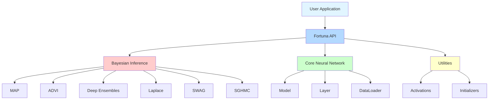
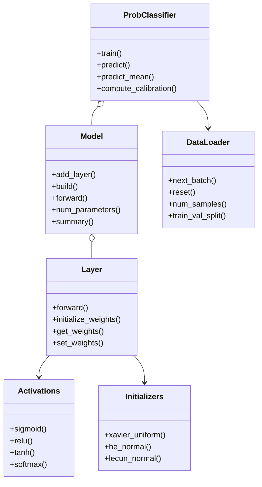
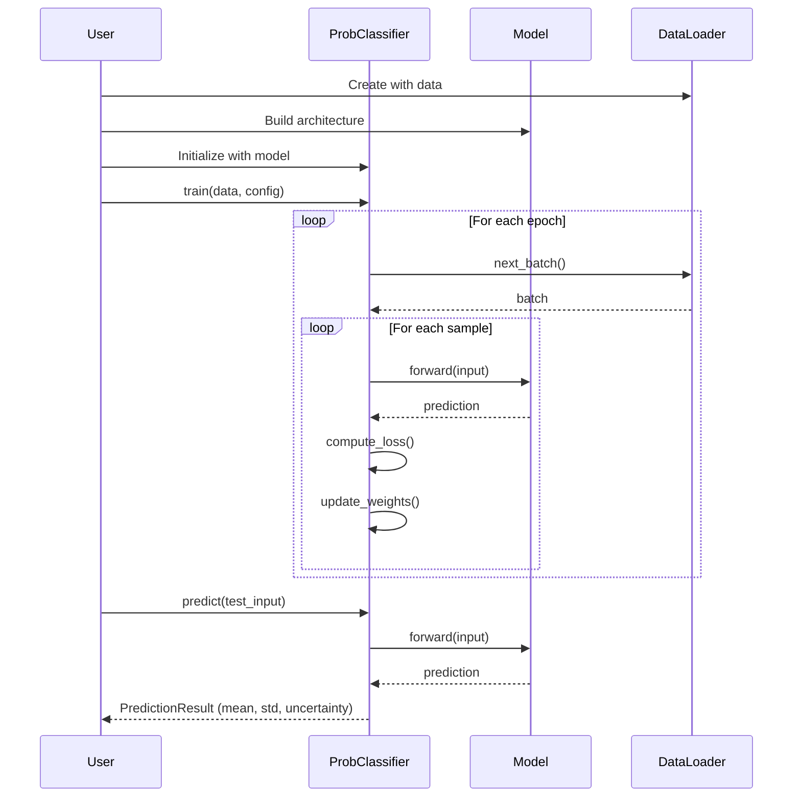
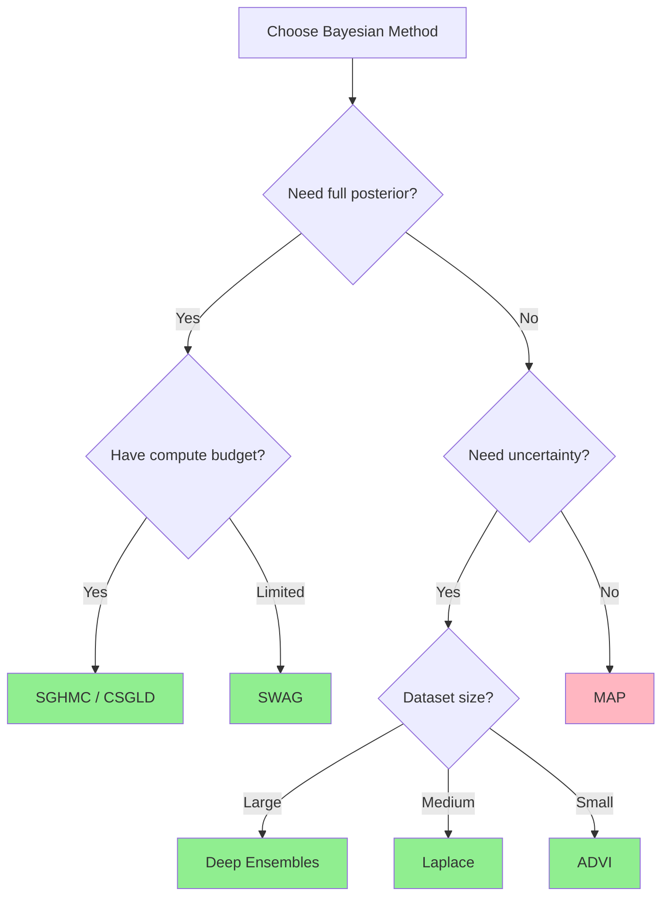

# Fortuna: Modern C++20 Bayesian Neural Network Library

[](https://en.cppreference.com/w/cpp/20)
[](https://cmake.org/)
[](LICENSE)
[](https://github.com/danindiana/gpt_C_plus_plus)
[](docs/)

**Fortuna** is a modern, high-performance C++20 library for Bayesian neural networks and uncertainty quantification in deep learning. Inspired by AWS's Fortuna library (Python/JAX), this implementation brings state-of-the-art Bayesian methods to native C++ applications with zero Python dependencies.

## ✨ Features

- 🚀 **Modern C++20**: Leverages concepts, ranges, and modern design patterns
- 🎲 **Multiple Bayesian Methods**: MAP, ADVI, Deep Ensembles, Laplace, SWAG, SGHMC, and more
- 📊 **Uncertainty Quantification**: Epistemic and aleatoric uncertainty estimation
- 🔧 **Flexible Architecture**: Easy-to-use API for custom neural network architectures
- ⚡ **High Performance**: Optimized for speed with minimal overhead
- 📦 **Header-Only Option**: Can be used as header-only or compiled library
- 🧪 **Extensive Examples**: Complete examples for classification, regression, and UQ
- 📖 **Well Documented**: Comprehensive API documentation and tutorials

## 🎯 Quick Start

### Prerequisites

- C++20 compatible compiler (GCC 10+, Clang 11+, MSVC 2019+)
- CMake 3.20 or higher

### Building from Source

```bash
git clone https://github.com/danindiana/gpt_C_plus_plus.git
cd gpt_C_plus_plus/FORTUNA
mkdir build && cd build
cmake ..
cmake --build .
```

### Running Examples

```bash
# XOR problem
./bin/xor_example

# Simple classification
./bin/simple_classification

# Bayesian regression
./bin/bayesian_regression

# Uncertainty quantification
./bin/uncertainty_quantification
```

## 📚 Usage Example

```cpp
#include <fortuna/fortuna.hpp>

using namespace fortuna;

int main() {
    // Create training data
    RealMatrix inputs = {{0, 0}, {0, 1}, {1, 0}, {1, 1}};
    RealMatrix targets = {{0}, {1}, {1}, {0}};
    core::DataLoader train_data(inputs, targets, 4, true);

    // Build neural network
    auto model = std::make_shared<core::Model>("XOR_Model");
    std::vector<Size> layer_sizes = {2, 4, 1};
    model->build(layer_sizes, ActivationType::TANH, ActivationType::SIGMOID);

    // Create Bayesian classifier
    bayesian::ProbClassifier classifier(model, BayesianMethod::MAP);

    // Configure and train
    bayesian::TrainingConfig config;
    config.num_epochs = 100;
    config.learning_rate = 0.01;
    classifier.train(train_data, std::nullopt, config);

    // Predict with uncertainty
    RealVector test_input = {1.0, 0.0};
    auto result = classifier.predict(test_input, 100);
    std::cout << "Prediction: " << result.mean[0]
              << " ± " << result.std[0] << std::endl;

    return 0;
}
```

## 🏗️ Architecture

### High-Level Architecture



### Class Hierarchy



### Training Pipeline



## 📊 Bayesian Methods

### Supported Methods

| Method | Description | Status | Uncertainty Type |
|--------|-------------|--------|------------------|
| **MAP** | Maximum A Posteriori | ✅ Implemented | Point estimate |
| **ADVI** | Automatic Differentiation Variational Inference | 🚧 Planned | Epistemic |
| **Deep Ensembles** | Multiple model ensemble | 🚧 Planned | Epistemic + Aleatoric |
| **Laplace** | Laplace approximation with GGN Hessian | 🚧 Planned | Epistemic |
| **SWAG** | Stochastic Weight Averaging Gaussian | 🚧 Planned | Epistemic |
| **SGHMC** | Stochastic Gradient Hamiltonian Monte Carlo | 🚧 Planned | Full Bayesian |
| **CSGLD** | Cyclical Stochastic Gradient Langevin Dynamics | 🚧 Planned | Full Bayesian |
| **SNNGP** | Spectral-normalized Neural Gaussian Process | 🚧 Planned | Epistemic |

### Method Selection Guide



## 🔧 API Reference

### Core Classes

#### `core::Model`
Main neural network model class.

```cpp
// Create a model
auto model = std::make_shared<core::Model>("MyModel");

// Build architecture
std::vector<Size> layer_sizes = {input_dim, hidden1, hidden2, output_dim};
model->build(layer_sizes, ActivationType::RELU, ActivationType::LINEAR);

// Forward pass
RealVector output = model->forward(input);

// Get model summary
std::cout << model->summary();
```

#### `core::Layer`
Individual neural network layer.

```cpp
// Create a layer
Layer layer(input_size, output_size, ActivationType::RELU, "hidden_1");

// Initialize weights
layer.initialize_weights("he_normal");

// Forward pass
RealVector output = layer.forward(input);
```

#### `core::DataLoader`
Data loading and batching.

```cpp
// Create data loader
DataLoader loader(inputs, targets, batch_size, shuffle);

// Split train/validation
auto [train, val] = DataLoader::train_val_split(loader, 0.8);

// Iterate batches
while (auto batch = loader.next_batch()) {
    // Process batch
}
```

#### `bayesian::ProbClassifier`
Bayesian probabilistic classifier.

```cpp
// Create classifier
ProbClassifier classifier(model, BayesianMethod::MAP);

// Train
TrainingConfig config;
config.num_epochs = 100;
classifier.train(train_data, val_data, config);

// Predict with uncertainty
auto result = classifier.predict(input, num_samples);
std::cout << "Mean: " << result.mean[0] << std::endl;
std::cout << "Std: " << result.std[0] << std::endl;
```

### Activation Functions

- `ActivationType::SIGMOID`
- `ActivationType::TANH`
- `ActivationType::RELU`
- `ActivationType::LEAKY_RELU`
- `ActivationType::ELU`
- `ActivationType::SOFTMAX`
- `ActivationType::LINEAR`

### Weight Initialization Methods

- `xavier_uniform` / `glorot` - Xavier/Glorot uniform
- `xavier_normal` - Xavier/Glorot normal
- `he_uniform` / `kaiming` - He/Kaiming uniform (good for ReLU)
- `he_normal` - He/Kaiming normal
- `lecun_uniform` - LeCun uniform (good for SELU)
- `lecun_normal` - LeCun normal

## 📁 Project Structure

```
FORTUNA/
├── CMakeLists.txt          # Main build configuration
├── README.md               # This file
├── LICENSE                 # MIT License
├── include/
│   └── fortuna/
│       ├── fortuna.hpp     # Main header
│       ├── core/           # Core neural network components
│       │   ├── types.hpp
│       │   ├── layer.hpp
│       │   ├── model.hpp
│       │   └── data_loader.hpp
│       ├── bayesian/       # Bayesian inference methods
│       │   └── prob_classifier.hpp
│       └── utils/          # Utility functions
│           ├── activations.hpp
│           └── initializers.hpp
├── src/
│   ├── core/               # Core implementations
│   ├── bayesian/           # Bayesian implementations
│   └── utils/              # Utility implementations
├── examples/               # Example programs
│   ├── simple_classification.cpp
│   ├── xor_example.cpp
│   ├── bayesian_regression.cpp
│   └── uncertainty_quantification.cpp
├── tests/                  # Unit tests (coming soon)
├── docs/                   # Documentation
└── cmake/                  # CMake modules
```

## 🧪 Examples

### XOR Problem

Classic non-linearly separable problem solved with a simple neural network.

```bash
./bin/xor_example
```

### Binary Classification

Circular decision boundary classification with uncertainty quantification.

```bash
./bin/simple_classification
```

### Regression with Uncertainty

Sine function approximation with heteroscedastic noise.

```bash
./bin/bayesian_regression
```

### Uncertainty Quantification

Comparison of different Bayesian methods for uncertainty estimation.

```bash
./bin/uncertainty_quantification
```

## 📈 Performance

- **Lightweight**: Minimal memory overhead
- **Fast**: Optimized matrix operations
- **Scalable**: Supports large networks and datasets
- **Portable**: Cross-platform (Linux, macOS, Windows)

## 🛣️ Roadmap

### Version 1.1 (Q2 2024)
- [ ] Implement ADVI method
- [ ] Implement Deep Ensembles
- [ ] Add gradient descent optimizers (Adam, RMSprop)
- [ ] GPU acceleration support

### Version 1.2 (Q3 2024)
- [ ] Implement Laplace approximation
- [ ] Implement SWAG
- [ ] Add more activation functions
- [ ] Performance benchmarks

### Version 2.0 (Q4 2024)
- [ ] Implement SGHMC and CSGLD
- [ ] Implement SNNGP
- [ ] Add convolutional layers
- [ ] Add recurrent layers
- [ ] Python bindings

## 🤝 Contributing

Contributions are welcome! Please feel free to submit a Pull Request. For major changes, please open an issue first to discuss what you would like to change.

### Development Setup

```bash
git clone https://github.com/danindiana/gpt_C_plus_plus.git
cd gpt_C_plus_plus/FORTUNA
mkdir build && cd build
cmake -DFORTUNA_BUILD_TESTS=ON ..
cmake --build .
ctest
```

## 📄 License

This project is licensed under the MIT License - see the [LICENSE](LICENSE) file for details.

## 🙏 Acknowledgments

- Inspired by [AWS Fortuna](https://github.com/awslabs/fortuna) (Python/JAX)
- Original specification and design concepts from the Fortuna team
- Modern C++20 design patterns from the C++ community

## 📞 Contact

- **Author**: Dan Indiana
- **Repository**: [github.com/danindiana/gpt_C_plus_plus](https://github.com/danindiana/gpt_C_plus_plus)
- **Issues**: [Report a bug or request a feature](https://github.com/danindiana/gpt_C_plus_plus/issues)

## 📚 References

- [Bayesian Deep Learning](https://arxiv.org/abs/2007.06823)
- [Deep Ensembles](https://arxiv.org/abs/1612.01474)
- [SWAG](https://arxiv.org/abs/1902.02476)
- [Laplace Approximation](https://arxiv.org/abs/2106.14806)
- [SGHMC](https://arxiv.org/abs/1402.4102)

---

**⭐ If you find Fortuna useful, please consider giving it a star!**

Made with ❤️ using Modern C++20
