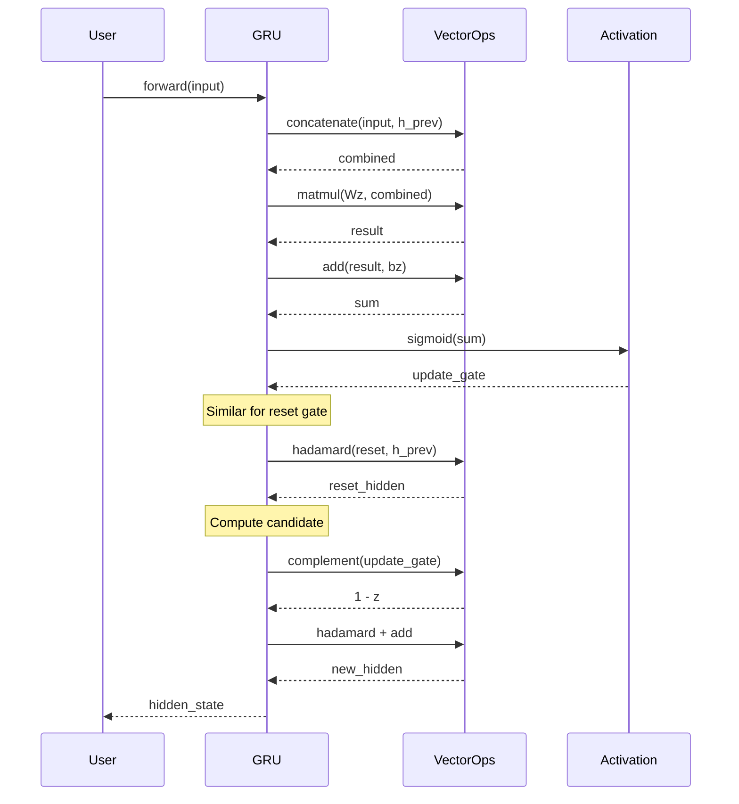

# GRU - Modern C++20 Implementation

[](https://en.cppreference.com/w/cpp/20)
[](https://cmake.org/)
[](LICENSE)
[]()

A modern, educational C++20 implementation of **Gated Recurrent Units (GRU)** - a type of recurrent neural network architecture for sequence modeling.

## 🌟 Features

- **Modern C++20**: Uses concepts, ranges, and contemporary best practices
- **Type Safety**: Compile-time checks with C++ concepts
- **Clean API**: Intuitive interface for sequence processing
- **Well Documented**: Comprehensive documentation with examples
- **Zero Dependencies**: Standard library only (no external ML frameworks)
- **Educational**: Clear, readable code ideal for learning RNN internals

## 📚 What is a GRU?

A **Gated Recurrent Unit (GRU)** is a type of recurrent neural network (RNN) that uses gating mechanisms to control information flow through the sequence. It was proposed by Cho et al. in 2014 as a simpler alternative to LSTM.

### Architecture

```mermaid
graph LR
    subgraph "GRU Cell at time t"
        X[x_t<br/>Input] --> C1[Concatenate]
        H[h_{t-1}<br/>Previous State] --> C1
        C1 --> Z[Update Gate<br/>σ]
        C1 --> R[Reset Gate<br/>σ]

        X --> C2[Concatenate]
        R --> M[⊙<br/>Hadamard]
        H --> M
        M --> C2
        C2 --> H_tilde[Candidate<br/>tanh]

        Z --> M1[⊙]
        H --> M1

        Z --> INV[1 - z_t]
        INV --> M2[⊙]
        H_tilde --> M2

        M1 --> ADD[+]
        M2 --> ADD
        ADD --> OUT[h_t<br/>New State]
    end

    style X fill:#e1f5ff
    style OUT fill:#e1ffe1
    style Z fill:#ffe1e1
    style R fill:#ffe1e1
    style H_tilde fill:#fff3e1
```

### Mathematical Formulation

The GRU computes the hidden state $h_t$ using the following equations:

**Update Gate:**
$$z_t = \sigma(W_z \cdot [x_t, h_{t-1}] + b_z)$$

**Reset Gate:**
$$r_t = \sigma(W_r \cdot [x_t, h_{t-1}] + b_r)$$

**Candidate Activation:**
$$\tilde{h}_t = \tanh(W_h \cdot [x_t, r_t \odot h_{t-1}] + b_h)$$

**New Hidden State:**
$$h_t = z_t \odot h_{t-1} + (1 - z_t) \odot \tilde{h}_t$$

Where:
- $\sigma$ is the sigmoid activation function
- $\odot$ denotes element-wise (Hadamard) product
- $[x_t, h_{t-1}]$ is vector concatenation

## 🚀 Quick Start

### Prerequisites

- **C++20 compliant compiler**:
  - GCC 10+ (recommended: GCC 13+)
  - Clang 13+ (recommended: Clang 17+)
  - MSVC 19.29+ (Visual Studio 2019 16.11+)
- **CMake 3.20+**

### Building

```bash
# Clone the repository
git clone https://github.com/danindiana/gpt_C_plus_plus.git
cd gpt_C_plus_plus/GRU

# Create build directory
mkdir build && cd build

# Configure and build
cmake ..
cmake --build .

# Run examples
./examples/basic_gru
./examples/sequence_processing
./examples/sentiment_analysis
```

### CMake Options

```cmake
option(GRU_BUILD_EXAMPLES "Build example programs" ON)
option(GRU_BUILD_TESTS "Build unit tests" ON)
option(GRU_ENABLE_WARNINGS "Enable compiler warnings" ON)
```

## 📖 Usage Examples

### Basic Usage

```cpp
#include "gru/gru.hpp"

int main() {
    // Create GRU cell: 5 input features, 10 hidden units
    gru::GRU gru_cell(5, 10);

    // Create input vector
    gru::Vector input = {1.0, 2.0, 3.0, 4.0, 5.0};

    // Forward pass
    gru::Vector hidden_state = gru_cell.forward(input);

    return 0;
}
```

### Sequence Processing

```cpp
#include "gru/gru.hpp"
#include <vector>

int main() {
    gru::GRU gru_cell(3, 8);

    // Create sequence of inputs
    std::vector<gru::Vector> sequence = {
        {1.0, 2.0, 3.0},
        {4.0, 5.0, 6.0},
        {7.0, 8.0, 9.0}
    };

    // Process entire sequence, get all hidden states
    auto all_states = gru_cell.forward_sequence(sequence, true);

    // Or get only the final state
    auto final_state = gru_cell.forward_sequence(sequence, false);

    return 0;
}
```

## 🏗️ Project Structure

```
GRU/
├── CMakeLists.txt              # Main build configuration
├── README.md                   # This file
├── include/                    # Public headers
│   └── gru/
│       ├── types.hpp           # Type definitions and concepts
│       ├── activation.hpp      # Activation functions (sigmoid, tanh, relu)
│       ├── vector_ops.hpp      # Vector/matrix operations
│       └── gru.hpp             # Main GRU class
├── src/                        # Implementation files
│   └── gru.cpp                 # GRU implementation
├── examples/                   # Example programs
│   ├── basic_gru.cpp          # Basic usage
│   ├── sequence_processing.cpp # Sequence handling
│   └── sentiment_analysis.cpp  # Toy sentiment classifier
├── tests/                      # Unit tests
│   └── ...
├── docs/                       # Additional documentation
│   └── ...
└── build/                      # Build artifacts (generated)
```

## 🔬 Implementation Details

### Modern C++20 Features

This implementation showcases several C++20 features:

- **Concepts**: Type constraints for template parameters
- **Ranges**: Modern algorithms and views
- **[[nodiscard]]**: Prevents accidental value discarding
- **constexpr**: Compile-time evaluation where possible

### Example: Using Concepts

```cpp
template<Numeric T>
[[nodiscard]] constexpr T sigmoid(T x) noexcept {
    return static_cast<T>(1.0) / (static_cast<T>(1.0) + std::exp(-x));
}
```

### Vector Operations

All vector operations use modern C++ algorithms:

```cpp
// Element-wise multiplication using ranges
[[nodiscard]] inline Vector hadamard(const Vector& a, const Vector& b) {
    Vector result;
    result.reserve(a.size());
    std::ranges::transform(a, b, std::back_inserter(result),
                          std::multiplies<>{});
    return result;
}
```

### Weight Initialization

Uses **Xavier/Glorot initialization** for better gradient flow:

$$W \sim \mathcal{U}\left(-\sqrt{\frac{6}{n_{in} + n_{out}}}, \sqrt{\frac{6}{n_{in} + n_{out}}}\right)$$

## 📊 Data Flow Diagram



## 🎯 Use Cases

### Educational Purposes

- **Learn RNN internals**: Understand how GRUs work step-by-step
- **Study C++20**: See modern C++ features in action
- **Algorithm implementation**: Clean, documented reference implementation

### Practical Applications (with training)

- Time series prediction
- Sequence classification
- Natural language processing
- Anomaly detection in sequences

> **Note**: This implementation provides the **forward pass** only. For practical ML applications, you would need to add:
> - Backpropagation through time (BPTT)
> - Optimization algorithms (SGD, Adam, etc.)
> - Loss functions
> - Training loops

## 🔧 Advanced Configuration

### Custom Initialization

```cpp
// Use Xavier initialization (recommended, default)
gru::GRU gru1(input_size, hidden_size, true);

// Use random initialization
gru::GRU gru2(input_size, hidden_size, false);
```

### Accessing Internal State

```cpp
// Get current hidden state
const auto& hidden = gru_cell.get_hidden_state();

// Reset to zeros
gru_cell.reset_state();

// Query dimensions
std::size_t in_size = gru_cell.input_size();
std::size_t h_size = gru_cell.hidden_size();
```

## 📝 API Reference

### Class: `gru::GRU`

#### Constructor

```cpp
explicit GRU(std::size_t input_size,
             std::size_t hidden_size,
             bool use_xavier = true);
```

#### Methods

| Method | Description | Return Type |
|--------|-------------|-------------|
| `forward(const Vector& x_t)` | Process single input, return new hidden state | `Vector` |
| `forward_sequence(...)` | Process sequence of inputs | `std::vector<Vector>` |
| `reset_state()` | Reset hidden state to zeros | `void` |
| `get_hidden_state()` | Get current hidden state | `const Vector&` |
| `input_size()` | Get input dimension | `std::size_t` |
| `hidden_size()` | Get hidden dimension | `std::size_t` |

## 🧪 Testing

```bash
cd build
ctest --output-on-failure
```

## 📚 References

1. **Cho et al. (2014)**: [Learning Phrase Representations using RNN Encoder-Decoder for Statistical Machine Translation](https://arxiv.org/abs/1406.1078)
2. **Chung et al. (2014)**: [Empirical Evaluation of Gated Recurrent Neural Networks on Sequence Modeling](https://arxiv.org/abs/1412.3555)
3. **Xavier Initialization**: [Understanding the difficulty of training deep feedforward neural networks](http://proceedings.mlr.press/v9/glorot10a.html)

## 🤝 Contributing

Contributions are welcome! Please feel free to submit issues or pull requests.

### Areas for Enhancement

- [ ] Backpropagation implementation
- [ ] Bidirectional GRU
- [ ] Multi-layer GRU (stacked)
- [ ] GPU acceleration (CUDA/OpenCL)
- [ ] Serialization (save/load weights)
- [ ] Additional optimization algorithms

## 📄 License

This project is licensed under the MIT License - see the LICENSE file for details.

## 🙏 Acknowledgments

- Inspired by the original GRU paper by Cho et al.
- Built with modern C++20 features
- Educational resource for understanding RNN internals

## 📧 Contact

For questions or feedback, please open an issue on GitHub.

---

**Made with ❤️ and modern C++**
