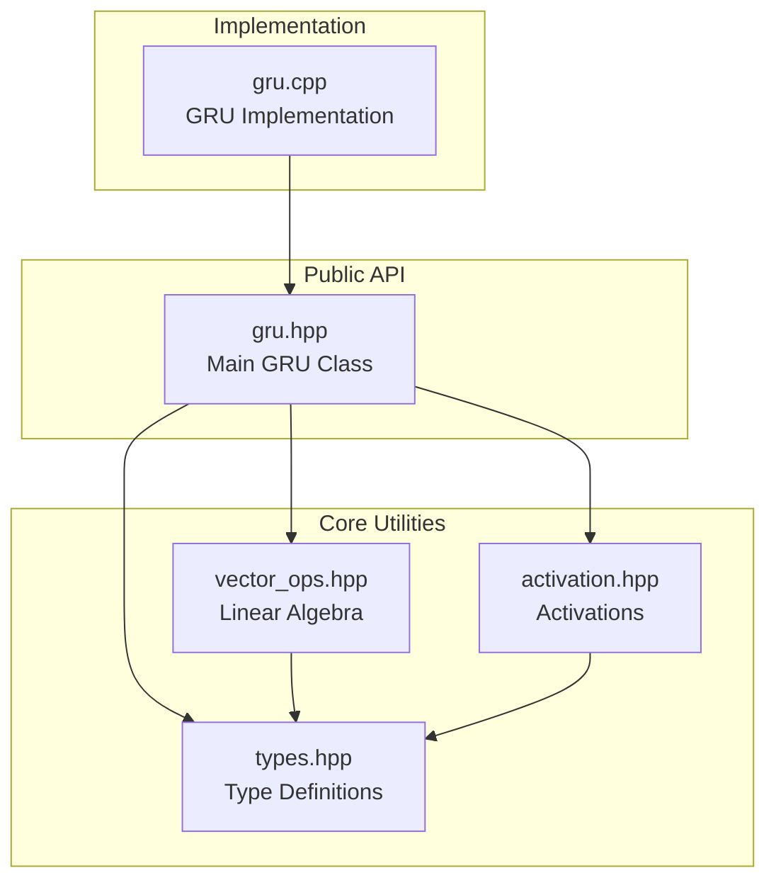

# GRU Architecture Documentation

## Overview

This document describes the internal architecture and design decisions of the GRU C++20 implementation.

## Design Philosophy

### 1. Modern C++20 First

The implementation embraces C++20 features:

- **Concepts**: Type safety at compile time
- **Ranges**: Expressive, composable algorithms
- **constexpr**: Maximum compile-time evaluation
- **[[nodiscard]]**: Prevent value discarding bugs

### 2. Zero External Dependencies

The implementation uses only the C++ standard library, making it:

- Easy to integrate
- Portable across platforms
- Lightweight and fast to compile

### 3. Educational Focus

Code prioritizes:

- Readability over micro-optimizations
- Clear naming and documentation
- Straightforward algorithms

## Module Structure



## Core Components

### Type System (`types.hpp`)

Provides:

- **Type Aliases**: `Vector`, `Matrix` for readability
- **Concepts**: `Numeric`, `VectorLike` for type safety

```cpp
template<typename T>
concept Numeric = std::is_arithmetic_v<T>;
```

### Vector Operations (`vector_ops.hpp`)

Implements fundamental linear algebra operations:

| Operation | Complexity | Description |
|-----------|------------|-------------|
| `add` | O(n) | Element-wise addition |
| `subtract` | O(n) | Element-wise subtraction |
| `hadamard` | O(n) | Element-wise multiplication |
| `scale` | O(n) | Scalar multiplication |
| `concatenate` | O(n+m) | Combine vectors |
| `matmul` | O(n×m) | Matrix-vector product |

**Design Decision**: Use ranges instead of raw loops for better expressiveness:

```cpp
std::ranges::transform(a, b, std::back_inserter(result), std::plus<>{});
```

### Activation Functions (`activation.hpp`)

Provides both scalar and vector versions:

- **Sigmoid**: σ(x) = 1/(1+e^(-x))
- **Tanh**: tanh(x)
- **ReLU**: max(0, x)

**Optimization**: Scalar functions are `constexpr` and `noexcept` for better optimization.

### GRU Cell (`gru.hpp`, `gru.cpp`)

#### Internal State

```cpp
class GRU {
private:
    std::size_t input_size_;
    std::size_t hidden_size_;

    Matrix Wz_, Wr_, Wh_;  // Weight matrices
    Vector bz_, br_, bh_;  // Bias vectors
    Vector h_prev_;        // Hidden state
};
```

#### Forward Pass Algorithm

```mermaid
flowchart TD
    START([Start]) --> INPUT[Input: x_t]
    INPUT --> CONCAT1[Concatenate x_t and h_{t-1}]

    CONCAT1 --> UPDATE[Compute Update Gate z_t]
    CONCAT1 --> RESET[Compute Reset Gate r_t]

    RESET --> HADAMARD[Hadamard: r_t ⊙ h_{t-1}]
    INPUT --> CONCAT2[Concatenate x_t and reset result]
    HADAMARD --> CONCAT2

    CONCAT2 --> CANDIDATE[Compute Candidate h̃_t]

    UPDATE --> COMP[Compute 1 - z_t]
    UPDATE --> TERM1[z_t ⊙ h_{t-1}]
    COMP --> TERM2[1-z_t ⊙ h̃_t]
    CANDIDATE --> TERM2

    TERM1 --> ADD[Add terms]
    TERM2 --> ADD

    ADD --> OUTPUT[Output: h_t]
    OUTPUT --> END([End])

    style START fill:#e1f5ff
    style END fill:#e1ffe1
    style UPDATE fill:#ffe1e1
    style RESET fill:#ffe1e1
    style CANDIDATE fill:#fff3e1
```

#### Sequence Processing

Two modes:

1. **Return All States**: Useful for encoder-decoder models
2. **Return Last State**: Useful for classification

```cpp
std::vector<Vector> forward_sequence(
    const std::vector<Vector>& sequence,
    bool return_sequences = false
);
```

## Weight Initialization

### Xavier/Glorot Initialization (Default)

Initializes weights uniformly in range:

$$[-\sqrt{\frac{6}{n_{in} + n_{out}}}, \sqrt{\frac{6}{n_{in} + n_{out}}}]$$

**Benefits**:
- Maintains variance across layers
- Prevents vanishing/exploding gradients
- Better convergence

**Implementation**:

```cpp
const double limit = std::sqrt(6.0 / (rows + cols));
std::uniform_real_distribution<double> dist(-limit, limit);
```

### Random Initialization (Alternative)

Normal distribution with small variance:

```cpp
std::normal_distribution<double> dist(0.0, 0.1);
```

## Memory Management

### Copy vs Move

- **Vectors returned by value**: Enables RVO/NRVO
- **Matrix storage**: Contiguous memory for cache efficiency
- **No dynamic allocation in hot paths**: All allocations at construction time

### Exception Safety

- **Strong guarantee**: If an operation fails, state remains unchanged
- **Input validation**: Dimension checking with clear error messages

## Performance Considerations

### Compiler Optimizations

Enable with:
- `-O3`: Aggressive optimization
- `-march=native`: Use CPU-specific instructions
- `-flto`: Link-time optimization

### Potential Optimizations (Future)

1. **SIMD**: Use `std::simd` (C++20) or intrinsics
2. **Parallel**: `std::execution::par` for large sequences
3. **GPU**: CUDA/OpenCL for matrix operations
4. **Quantization**: INT8/FP16 for inference

## Error Handling

### Input Validation

```cpp
void validate_input(const Vector& x) const {
    if (x.size() != input_size_) {
        throw std::invalid_argument("Dimension mismatch");
    }
}
```

### Dimension Checking

All operations verify dimensions and throw `std::invalid_argument` on mismatch.

## Testing Strategy

### Unit Tests

Test levels:

1. **Function-level**: Individual activation/vector operations
2. **Class-level**: GRU construction and methods
3. **Integration**: Sequence processing end-to-end

### Test Coverage

- Activation functions (boundary values)
- Vector operations (dimension mismatches)
- GRU forward pass (stateful behavior)
- Sequence processing (both modes)

## Future Enhancements

### Training Support

To add training capabilities:

1. **Backpropagation Through Time (BPTT)**
   - Store intermediate activations
   - Compute gradients
   - Update weights

2. **Optimizers**
   - SGD, Adam, RMSprop
   - Learning rate scheduling
   - Gradient clipping

3. **Loss Functions**
   - MSE, Cross-entropy
   - Gradient computation

### Advanced Features

- **Bidirectional GRU**: Process sequences forward and backward
- **Stacked GRU**: Multiple layers
- **Attention Mechanisms**: Attention weights over sequence
- **Dropout**: Regularization during training

## References

1. [Cho et al., 2014](https://arxiv.org/abs/1406.1078) - Original GRU paper
2. [Xavier Initialization](http://proceedings.mlr.press/v9/glorot10a.html)
3. [C++20 Ranges](https://en.cppreference.com/w/cpp/ranges)
4. [C++20 Concepts](https://en.cppreference.com/w/cpp/concepts)

---

**Last Updated**: 2024
