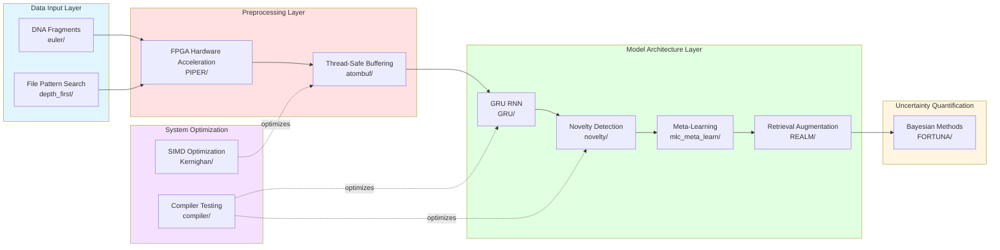
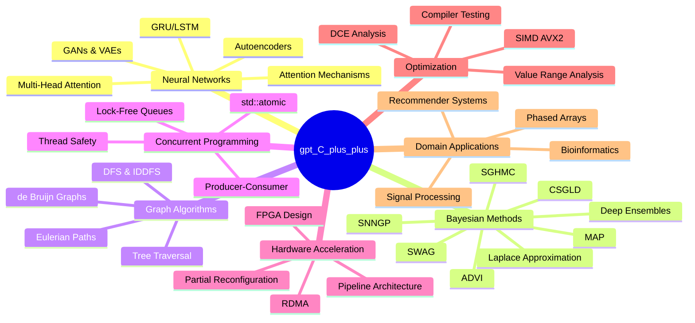
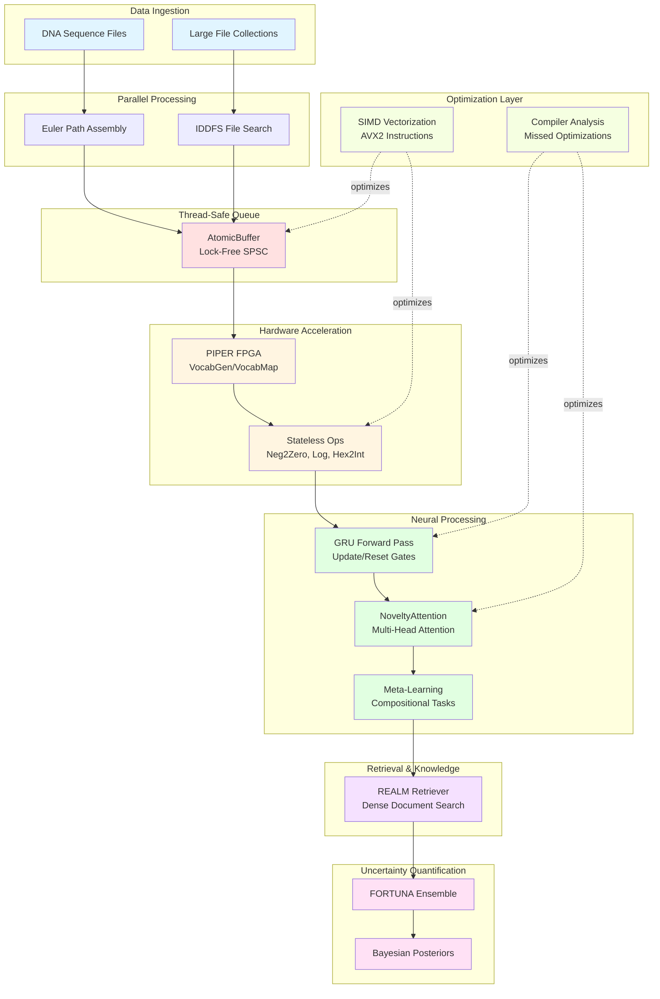
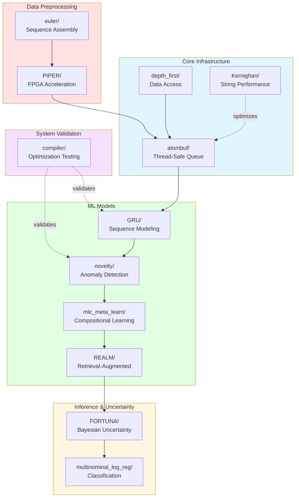

```mermaid
graph TD
    A[gpt_C_plus_plus Repository] --> B[Machine Learning]
    A --> C[Data Structures & Algorithms]
    A --> D[System Optimization]
    A --> E[Domain-Specific Applications]

    B --> B1[GRU - Recurrent Neural Networks]
    B --> B2[FORTUNA - Bayesian Deep Learning]
    B --> B3[REALM - Retrieval-Augmented LM]
    B --> B4[mlc_meta_learn - Meta-Learning]
    B --> B5[novelty - Novelty Detection]

    C --> C1[atombuf - Atomic Circular Buffer]
    C --> C2[depth_first - File Search Algorithms]
    C --> C3[euler - Eulerian Path & DNA Assembly]

    D --> D1[compiler - Optimization Testing]
    D --> D2[PIPER - FPGA Acceleration]
    D --> D3[Kernighan - libc Performance]

    E --> E1[arena - Phased Array Antennas]
    E --> E2[multinominal_log_reg - Classification]

    style A fill:#e1f5ff
    style B fill:#ffe1e1
    style C fill:#e1ffe1
    style D fill:#fff5e1
    style E fill:#f5e1ff
```

# gpt_C_plus_plus

A comprehensive educational repository implementing machine learning algorithms, data structures, compiler optimization techniques, and bioinformatics algorithms in C/C++.

## 🎯 Overview

This repository demonstrates modern ML architectures, system optimization techniques, classical algorithms, and concurrent programming patterns. Each component can be studied individually or integrated into a complete ML pipeline.

---

## 📊 Repository Structure



---

## 🔄 ML Pipeline Architecture



---

## 🏗️ Technology Stack



---

## 📁 Directory Guide

### Machine Learning Components

| Directory | Purpose | Key Technologies |
|-----------|---------|------------------|
| **[GRU/](GRU/)** | Gated Recurrent Unit implementation | RNNs, Matrix operations, Activation functions |
| **[FORTUNA/](FORTUNA/)** | 8 Bayesian uncertainty estimation methods | MAP, ADVI, Deep Ensembles, SWAG, SGHMC |
| **[REALM/](REALM/)** | Retrieval-Augmented Language Model | MIPS, Dense retrieval, MLM |
| **[mlc_meta_learn/](mlc_meta_learn/)** | Meta-learning for compositional skills | Episode-based training, Systematic compositionality |
| **[novelty/](novelty/)** | Novelty detection mechanisms | Autoencoders, GANs, One-Class NNs, Memory networks |
| **[multinominal_log_reg/](multinominal_log_reg/)** | Multinomial logistic regression | Classification, Softmax |

### Data Structures & Algorithms

| Directory | Purpose | Key Technologies |
|-----------|---------|------------------|
| **[atombuf/](atombuf/)** | Thread-safe atomic circular buffer | C++11 atomics, Lock-free programming |
| **[depth_first/](depth_first/)** | File search with IDDFS | Depth-first search, Pattern matching |
| **[euler/](euler/)** | DNA sequence reconstruction | Eulerian paths, de Bruijn graphs |

### System Optimization

| Directory | Purpose | Key Technologies |
|-----------|---------|------------------|
| **[compiler/](compiler/)** | Compiler optimization testing | DCE, Value range analysis, Csmith |
| **[PIPER/](PIPER/)** | FPGA-based ML preprocessor | FPGA, RDMA, 64-byte pipeline units |
| **[Kernighan/](Kernighan/)** | libc performance optimization | AVX2 SIMD, `__strcmp_avx2` |

### Domain-Specific Applications

| Directory | Purpose | Key Technologies |
|-----------|---------|------------------|
| **[arena/](arena/)** | Phased array antenna simulation | Signal processing, Beam steering |

---

## 🔬 Component Interaction Details



---

## 🚀 Quick Start

### Building Individual Components

```bash
# GRU Neural Network
cd GRU/
g++ -std=c++11 -O3 GRU_toy_all_helpers.cpp -o gru_demo
./gru_demo

# Atomic Buffer (Thread-Safe Queue)
cd atombuf/
g++ -std=c++11 -pthread AtomicBufferTest.cpp -o atomic_test
./atomic_test

# Eulerian Path DNA Assembly
cd euler/
gcc -O2 dna_seq.c -o dna_seq
./dna_seq

# File Search with IDDFS
cd depth_first/
g++ -std=c++17 FileSearchIDDFS.cpp -o file_search
./file_search

# Novelty Detection
cd novelty/
g++ -std=c++11 -O3 novelty_score.cpp -o novelty
./novelty

# Phased Array Simulation
cd arena/
g++ -std=c++11 phased_array.cpp -o phased_array
./phased_array
```

---

## 🧪 Tested Environment

**Primary Test Platform:**
- **OS:** Ubuntu 22.04 LTS (Jammy Jellyfish)
- **Kernel:** x86_64 Linux 6.2.0-36-generic
- **Compiler:** GCC 11+ (C++11/C++17 support required)
- **CPU:** AMD Ryzen 9 5950X 16-Core @ 32x 2.8GHz
- **GPU:** NVIDIA GeForce RTX 3060, GTX 1060 6GB
- **RAM:** 128GB DDR4

**Desktop Environment:**
- Shell: bash 5.1.16
- DE: GNOME 41.7
- WM: Mutter
- Resolution: 2560x1080

---

## 📚 Detailed Documentation

Each subdirectory contains comprehensive README files:

- **[PIPER/readme.md](PIPER/readme.md)** (131KB) - Complete FPGA accelerator specification with formal methods
- **[REALM/readme.md](REALM/readme.md)** (65KB) - Retrieval-augmented language model architecture
- **[FORTUNA/readme.md](FORTUNA/readme.md)** (35KB) - 8 Bayesian uncertainty estimation techniques
- **[atombuf/atombufreadme.txt](atombuf/atombufreadme.txt)** (21KB) - Lock-free atomic buffer implementation guide
- **[novelty/novelty.txt](novelty/novelty.txt)** (14KB) - Comprehensive novelty detection methods
- **[compiler/readme.md](compiler/readme.md)** (9.5KB) - Compiler optimization detection methodology
- **[mlc_meta_learn/readme.txt](mlc_meta_learn/readme.txt)** (8.2KB) - Meta-learning compositionality research
- **[euler/readme.md](euler/readme.md)** (4.7KB) - Eulerian graphs & DNA sequence assembly

---

## 🎓 Key Concepts Demonstrated

```mermaid
graph LR
    subgraph Algorithms
        A1[Graph Theory<br/>Eulerian Paths]
        A2[Search Algorithms<br/>DFS, IDDFS]
        A3[DNA Assembly<br/>de Bruijn Graphs]
    end

    subgraph "Neural Networks"
        B1[RNN Architecture<br/>GRU Gates]
        B2[Attention<br/>Multi-Head]
        B3[Generative Models<br/>VAE, GAN]
    end

    subgraph "Concurrent Programming"
        C1[Lock-Free<br/>Atomics]
        C2[Producer-Consumer<br/>Patterns]
        C3[Thread Safety<br/>SPSC Queue]
    end

    subgraph "System Optimization"
        D1[SIMD<br/>AVX2]
        D2[FPGA Design<br/>Hardware Accel]
        D3[Compiler Analysis<br/>Optimization Detection]
    end

    subgraph "Statistical Methods"
        E1[Bayesian Inference<br/>8 Methods]
        E2[Uncertainty<br/>Quantification]
        E3[Meta-Learning<br/>Compositionality]
    end

    style Algorithms fill:#e1f5ff
    style "Neural Networks" fill:#ffe1e1
    style "Concurrent Programming" fill:#e1ffe1
    style "System Optimization" fill:#fff5e1
    style "Statistical Methods" fill:#f5e1ff
```

### Programming Paradigms Covered:

1. **Concurrent Programming** - Lock-free atomics, thread-safe data structures
2. **Computational Complexity** - Algorithm analysis (IDDFS O(b^d), graph algorithms)
3. **Neural Network Implementation** - RNN cells, activation functions, matrix operations
4. **Graph Theory** - Eulerian paths, cycle detection, de Bruijn graphs
5. **Low-Level Optimization** - SIMD (AVX2), FPGA design, compiler interaction
6. **Statistical Methods** - Bayesian inference, uncertainty quantification, ensemble methods
7. **Signal Processing** - Phased array antenna steering, beam forming
8. **Bioinformatics** - DNA sequence assembly from overlapping fragments

---

## 🔗 Component Dependencies



---

## 🎯 Use Cases

### 1. **Bioinformatics Pipeline**
```
euler/ (DNA assembly) → PIPER/ (preprocessing) → GRU/ (sequence analysis) → FORTUNA/ (uncertainty)
```

### 2. **High-Performance ML Inference**
```
depth_first/ (data access) → atombuf/ (buffering) → PIPER/ (acceleration) → GRU/ (inference)
```

### 3. **Anomaly Detection System**
```
Data → PIPER/ (preprocessing) → novelty/ (detection) → FORTUNA/ (confidence scoring)
```

### 4. **Meta-Learning Research**
```
mlc_meta_learn/ (compositional learning) → REALM/ (knowledge retrieval) → FORTUNA/ (uncertainty)
```

---

## 🛠️ Suggested Improvements

### Repository Structure Enhancements:

1. **Add Top-Level Build System**
   - Create CMakeLists.txt for unified building
   - Add Makefile with targets for all components

2. **Create docs/ Directory**
   - Move large README files to centralized docs/
   - Add API documentation with Doxygen
   - Include performance benchmarks

3. **Add examples/ Directory**
   - End-to-end pipeline examples
   - Integration examples showing component interaction
   - Jupyter notebooks for ML components

4. **Add tests/ Directory**
   - Unit tests for each component
   - Integration tests for pipelines
   - Performance regression tests

5. **Add benchmarks/ Directory**
   - Performance comparison data
   - Optimization impact measurements
   - Hardware acceleration speedup metrics

6. **Create docker/ Directory**
   - Dockerfile for reproducible builds
   - Docker Compose for multi-component testing
   - CI/CD pipeline configurations

---

## 📈 Performance Characteristics

| Component | Key Metric | Performance |
|-----------|------------|-------------|
| **PIPER** | Speedup vs CPU | 39-105× |
| **PIPER** | Speedup vs GPU | 3-17× |
| **PIPER** | Power Efficiency | 2.9-6.4× better than GPU |
| **AtomicBuffer** | Throughput | Lock-free (wait-free operations) |
| **GRU** | Complexity | O(n) per timestep |
| **IDDFS** | Complexity | O(b^d) where b=branching, d=depth |
| **Euler Path** | Complexity | O(E) where E=edges |

---

## 📖 License

See [LICENSE](LICENSE) file for details.

---

## 🤝 Contributing

Each component is self-contained and can be studied/improved independently. When contributing:

1. Maintain C++11/C++17 compatibility
2. Include comprehensive comments
3. Update relevant README files
4. Add performance benchmarks where applicable
5. Test on Ubuntu 22.04+ with GCC 11+

---

## 🔍 Quick Reference

### Key Files by Interest:

**Machine Learning:**
- `GRU/GRU_toy_all_helpers.cpp` - Complete GRU implementation
- `novelty/novelty_score.cpp` - Novelty detection with attention
- `mlc_meta_learn/mlc.cpp` - Meta-learning framework

**Algorithms:**
- `euler/dna_seq.c` - DNA sequence assembly
- `depth_first/IDDFS.cpp` - Iterative deepening search
- `atombuf/AtomicBuffer.hpp` - Lock-free circular buffer

**Optimization:**
- `PIPER/readme.md` - FPGA acceleration architecture
- `compiler/readme.md` - Compiler optimization analysis
- `Kernighan/libc_so_6.md` - SIMD string optimization

**Documentation:**
- `FORTUNA/readme.md` - 8 Bayesian methods explained
- `REALM/readme.md` - Retrieval-augmented LM architecture
- `novelty/novelty.txt` - Comprehensive novelty detection guide

---

*This repository serves as an educational resource demonstrating the implementation of advanced ML algorithms, data structures, and system optimization techniques in C/C++.*
