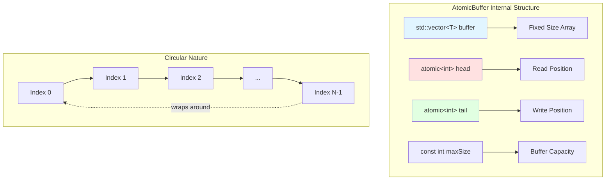
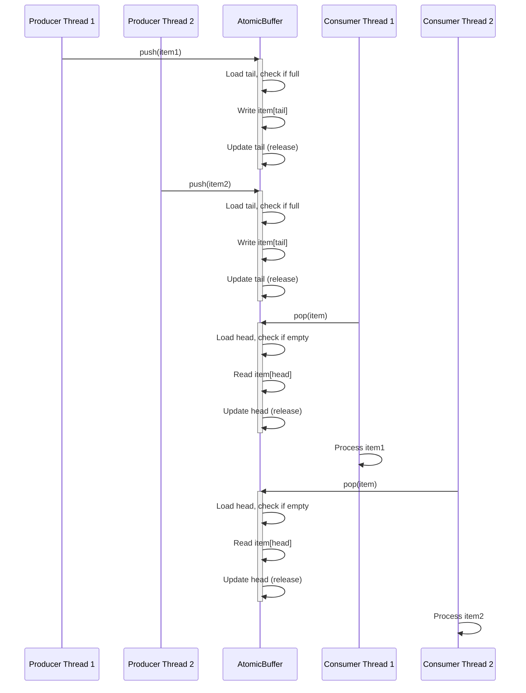
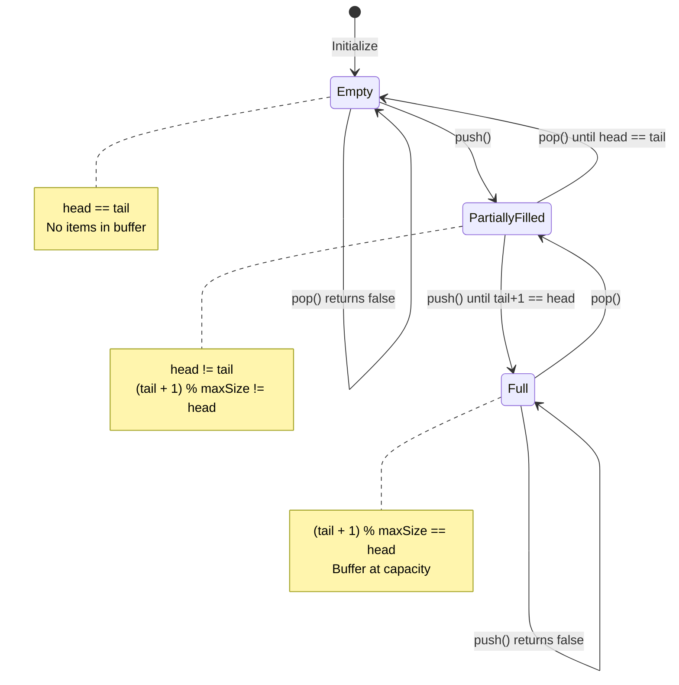
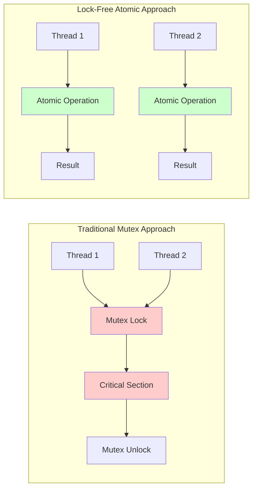
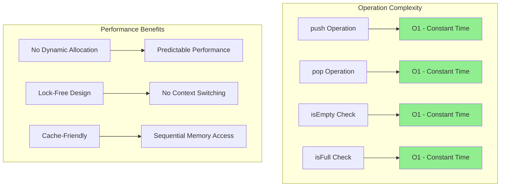
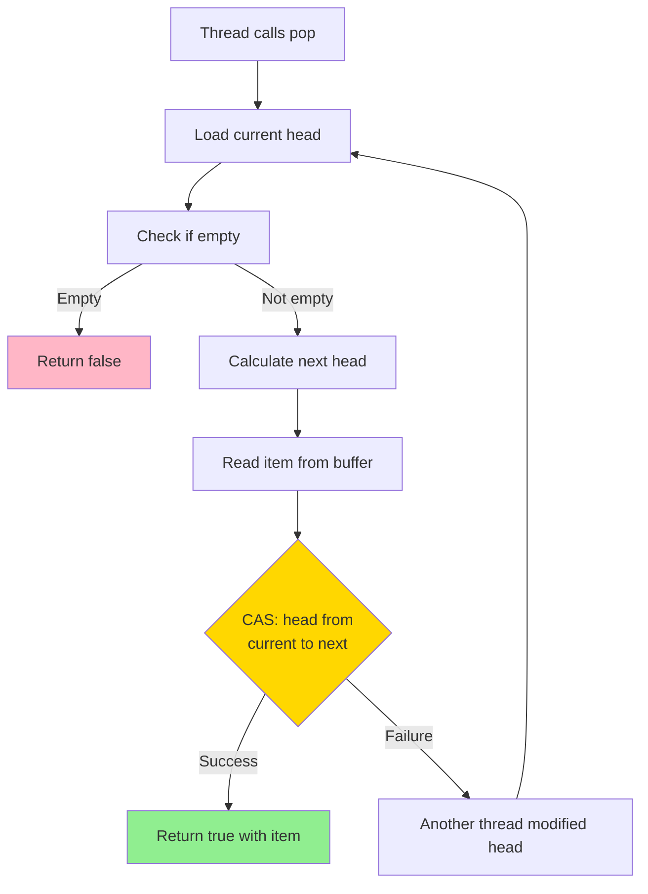
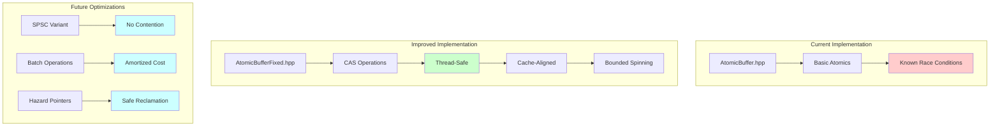

# AtomicBuffer: Lock-Free Circular Buffer Implementation

## Overview

**AtomicBuffer** is a high-performance, lock-free circular buffer implementation in modern C++ designed for efficient producer-consumer communication in multi-threaded environments. This implementation leverages C++ atomics and memory ordering semantics to achieve thread-safe operations without traditional mutex locks.

### Key Features

- **Lock-Free Design**: Uses atomic operations instead of mutex locks for better performance
- **Circular Buffer Architecture**: Fixed-size ring buffer with O(1) push/pop operations
- **Multi-Producer/Multi-Consumer Support**: Designed to handle multiple concurrent producers and consumers
- **Memory Efficient**: Pre-allocated buffer with no dynamic memory allocation during operations
- **Header-Only Library**: Simple integration into existing projects

### Project Status

⚠️ **Current Implementation Note**: The basic `AtomicBuffer.hpp` implementation has known thread-safety issues under high-contention scenarios with multiple producers/consumers. The implementation uses simple atomic loads/stores which can lead to race conditions. See the [Thread Safety](#thread-safety-considerations) section for details and the improved implementation.

## Architecture

### Buffer Structure



### Producer-Consumer Flow



### State Transitions



## Core Concepts

### Lock-Free Programming Fundamentals



### Memory Ordering Semantics

The implementation uses C++ memory ordering to ensure correctness:

| Operation | Memory Order | Purpose |
|-----------|-------------|---------|
| `tail.load()` | `memory_order_relaxed` | Read current tail position (no synchronization needed) |
| `head.load()` in push | `memory_order_acquire` | Ensure we see all previous consumer operations |
| `head.load()` in pop | `memory_order_relaxed` | Read current head position |
| `tail.load()` in pop | `memory_order_acquire` | Ensure we see all previous producer operations |
| `tail.store()` | `memory_order_release` | Make written item visible to consumers |
| `head.store()` | `memory_order_release` | Make consumed slot visible to producers |

### Novelty and Performance Characteristics

#### Time Complexity



#### Performance Comparison

| Feature | Mutex-Based Queue | AtomicBuffer (Lock-Free) |
|---------|------------------|--------------------------|
| **Contention Handling** | Blocking (thread sleeps) | Non-blocking (spin/yield) |
| **Context Switches** | High under contention | Minimal |
| **Latency** | Variable (depends on scheduler) | Predictable |
| **Throughput** | Lower (serialized access) | Higher (concurrent operations) |
| **Priority Inversion** | Possible | Not possible |
| **Memory Overhead** | Mutex + queue | Just buffer + 2 atomics |

#### Novelty Calculations

The lock-free design provides several key innovations:

1. **ABA Problem Mitigation**: While not fully solved in the basic implementation, the circular buffer design with separate head/tail reduces ABA scenarios
2. **Wait-Free Progress**: Consumers can always check for data without blocking
3. **Bounded Memory**: Fixed-size allocation prevents memory bloat
4. **Cache Line Optimization**: Head and tail atomics can be aligned to separate cache lines (future enhancement)

## Thread Safety Considerations

### Known Issues in Basic Implementation

The current `AtomicBuffer.hpp` has a critical race condition:

```cpp
// PROBLEMATIC CODE - Race Condition Example
bool pop(T& item) {
    int currentHead = head.load(std::memory_order_relaxed);

    // ⚠️ RACE CONDITION: Multiple threads can read same currentHead
    if (currentHead == tail.load(std::memory_order_acquire)) {
        return false;
    }

    // ⚠️ Multiple threads can read from same index
    item = buffer[currentHead];

    // ⚠️ Multiple threads can update head, causing lost items
    head.store((currentHead + 1) % maxSize, std::memory_order_release);
    return true;
}
```

**Problem**: Multiple consumer threads can:
1. Read the same `currentHead` value
2. Copy the same item from the buffer
3. Each increment `head`, causing items to be skipped

### Solution: Compare-and-Swap (CAS)

The proper solution uses atomic compare-and-swap operations:



## Building and Compilation

### C++ Standard Requirements

- **Minimum**: C++11 (for `std::atomic`, `std::thread`)
- **Recommended**: C++17 or later
- **Optimal**: C++20 (for better atomic wait/notify support)

### Compiler Support

| Compiler | Minimum Version | Recommended Version |
|----------|----------------|-------------------|
| **GCC** | 4.8+ | 9.0+ |
| **Clang** | 3.3+ | 10.0+ |
| **MSVC** | Visual Studio 2015+ | Visual Studio 2019+ |
| **Intel ICC** | 15.0+ | 19.0+ |

### Compilation Examples

#### Using g++

```bash
# Basic compilation (C++11)
g++ -std=c++11 -pthread -o test AtomicBufferTest.cpp

# With optimizations (C++17)
g++ -std=c++17 -O3 -pthread -o test AtomicBufferTest.cpp

# With warnings and debug symbols
g++ -std=c++17 -Wall -Wextra -g -pthread -o test AtomicBufferTest.cpp

# With sanitizers for testing
g++ -std=c++17 -fsanitize=thread -g -pthread -o test AtomicBufferTest.cpp
```

#### Using clang++

```bash
# Basic compilation
clang++ -std=c++17 -pthread -o test AtomicBufferTest.cpp

# With optimizations
clang++ -std=c++17 -O3 -pthread -o test AtomicBufferTest.cpp

# With thread sanitizer
clang++ -std=c++17 -fsanitize=thread -g -pthread -o test AtomicBufferTest.cpp
```

#### Using CMake (Recommended)

See `CMakeLists.txt` for modern build configuration.

```bash
mkdir build && cd build
cmake ..
cmake --build .
ctest  # Run tests
```

### Compiler Flags Explained

| Flag | Purpose |
|------|---------|
| `-std=c++17` | Enable C++17 standard features |
| `-pthread` | Link pthread library (required for std::thread) |
| `-O3` | Maximum optimization level |
| `-Wall -Wextra` | Enable all warnings |
| `-g` | Include debug symbols |
| `-fsanitize=thread` | Enable ThreadSanitizer for race detection |
| `-fsanitize=address` | Enable AddressSanitizer for memory errors |

## Usage Examples

### Basic Producer-Consumer

```cpp
#include "AtomicBuffer.hpp"
#include <thread>
#include <iostream>

int main() {
    AtomicBuffer<int> buffer(100);  // Buffer of size 100

    // Producer thread
    std::thread producer([&buffer]() {
        for (int i = 0; i < 1000; ++i) {
            while (!buffer.push(i)) {
                std::this_thread::yield();
            }
        }
    });

    // Consumer thread
    std::thread consumer([&buffer]() {
        int item;
        for (int i = 0; i < 1000; ++i) {
            while (!buffer.pop(item)) {
                std::this_thread::yield();
            }
            std::cout << "Consumed: " << item << std::endl;
        }
    });

    producer.join();
    consumer.join();

    return 0;
}
```

### Advanced: Multiple Producers and Consumers

```cpp
#include "AtomicBuffer.hpp"
#include <thread>
#include <vector>
#include <atomic>

constexpr int NUM_PRODUCERS = 4;
constexpr int NUM_CONSUMERS = 4;
constexpr int ITEMS_PER_PRODUCER = 1000;

int main() {
    AtomicBuffer<int> buffer(128);
    std::atomic<int> total_produced{0};
    std::atomic<int> total_consumed{0};

    std::vector<std::thread> threads;

    // Launch producers
    for (int i = 0; i < NUM_PRODUCERS; ++i) {
        threads.emplace_back([&, i]() {
            for (int j = 0; j < ITEMS_PER_PRODUCER; ++j) {
                int item = i * ITEMS_PER_PRODUCER + j;
                while (!buffer.push(item)) {
                    std::this_thread::yield();
                }
                total_produced.fetch_add(1, std::memory_order_relaxed);
            }
        });
    }

    // Launch consumers
    for (int i = 0; i < NUM_CONSUMERS; ++i) {
        threads.emplace_back([&]() {
            int item;
            while (total_consumed.load() < NUM_PRODUCERS * ITEMS_PER_PRODUCER) {
                if (buffer.pop(item)) {
                    total_consumed.fetch_add(1, std::memory_order_relaxed);
                    // Process item...
                } else {
                    std::this_thread::yield();
                }
            }
        });
    }

    // Wait for all threads
    for (auto& t : threads) {
        t.join();
    }

    return 0;
}
```

## Testing

### Available Tests

| Test File | Purpose | Complexity |
|-----------|---------|-----------|
| `AtomicBufferTest.cpp` | Basic single producer/consumer test | Simple |
| `AtomicBufferStressTest.cpp` | Multi-threaded stress testing | Medium |
| `AtomicBufferDetailedTest.cpp` | Detailed logging and verification | Medium |
| `AtomicBufferLoggedTest.cpp` | Buffer state logging for debugging | Advanced |

### Running Tests

```bash
# Compile and run basic test
g++ -std=c++17 -pthread -o basic_test AtomicBufferTest.cpp
./basic_test

# Compile and run stress test with sanitizer
g++ -std=c++17 -fsanitize=thread -pthread -o stress_test AtomicBufferStressTest.cpp
./stress_test

# Compile and run with valgrind
g++ -std=c++17 -g -pthread -o test AtomicBufferTest.cpp
valgrind --tool=helgrind ./test
```

### Performance Benchmarking

See `AtomicBufferBenchmark.cpp` for detailed performance measurements across different scenarios:
- Single producer, single consumer
- Multiple producers, single consumer
- Single producer, multiple consumers
- Multiple producers, multiple consumers

## Project Structure

```
atombuf/
├── README.md                      # This file
├── CMakeLists.txt                 # Modern build configuration
├── AtomicBuffer.hpp               # Basic lock-free buffer (has known issues)
├── AtomicBufferFixed.hpp          # Fixed version with CAS operations
├── AtomicBufferLogged.hpp         # Version with debug logging
├── AtomicBufferTest.cpp           # Basic functionality test
├── AtomicBufferStressTest.cpp     # Multi-threaded stress test
├── AtomicBufferDetailedTest.cpp   # Detailed verification test
├── AtomicBufferLoggedTest.cpp     # Test with state logging
├── AtomicBufferTerminalTest.cpp   # Interactive terminal test
├── AtomicBufferBenchmark.cpp      # Performance benchmarks
└── atombufreadme.txt             # Original development notes
```

## Future Enhancements

### Planned Features

1. **Cache Line Alignment**: Separate head/tail to different cache lines to reduce false sharing
2. **Wait/Notify Support**: Use C++20 atomic wait/notify for better efficiency
3. **Bounded Spinning**: Implement adaptive backoff strategies
4. **Memory Reclamation**: Hazard pointers for safe memory management
5. **SPSC Optimization**: Single-producer single-consumer optimized variant
6. **Batch Operations**: push_batch/pop_batch for improved throughput

### Architectural Improvements



## Contributing

Contributions are welcome! Areas of focus:
- Performance optimizations
- Additional test cases
- Documentation improvements
- Platform-specific optimizations
- Benchmarking on different hardware

## References

### Academic Papers
- Maurice Herlihy and Nir Shavit, "The Art of Multiprocessor Programming"
- Maged M. Michael and Michael L. Scott, "Simple, Fast, and Practical Non-Blocking and Blocking Concurrent Queue Algorithms"

### C++ Standards
- [C++11 Memory Model](https://en.cppreference.com/w/cpp/atomic/memory_order)
- [C++20 Atomic Wait/Notify](https://en.cppreference.com/w/cpp/atomic/atomic/wait)

### Related Projects
- [Folly ProducerConsumerQueue](https://github.com/facebook/folly/blob/main/folly/ProducerConsumerQueue.h)
- [Boost Lockfree Queue](https://www.boost.org/doc/libs/release/doc/html/lockfree.html)
- [moodycamel::ConcurrentQueue](https://github.com/cameron314/concurrentqueue)

## License

See repository LICENSE file.

## Acknowledgments

This implementation is inspired by classic lock-free data structure research and modern C++ concurrency practices.
