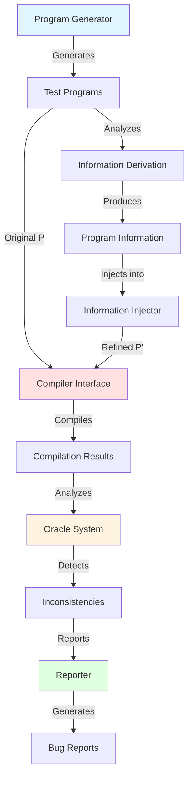
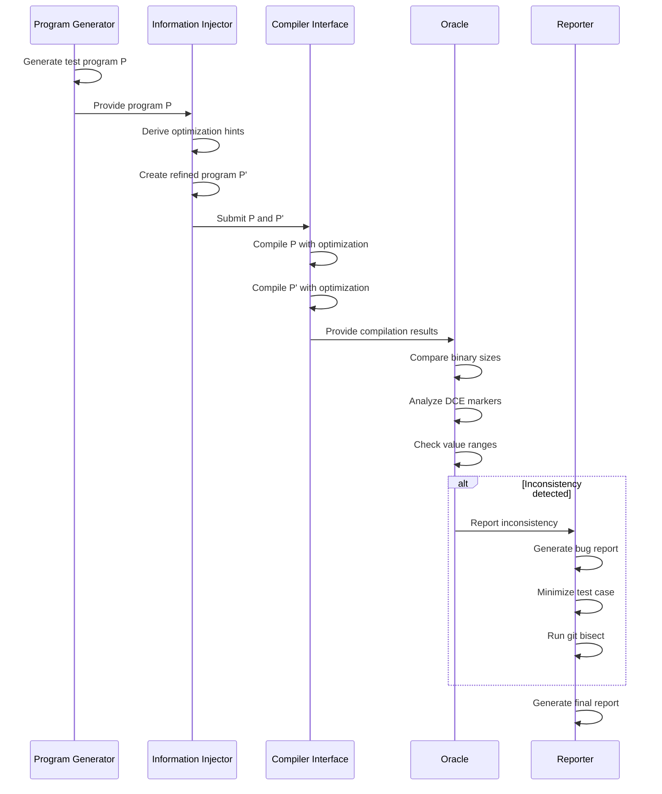

# Compiler Optimization Inconsistency Tester

[](https://en.cppreference.com/w/cpp/23)
[](https://cmake.org/)
[](LICENSE)
[](https://gcc.gnu.org/)
[](https://clang.llvm.org/)
[](https://github.com/danindiana/gpt_C_plus_plus)

> A modern C++23 framework for detecting optimization inconsistencies in compilers using refined input analysis.

## Overview

This project implements an advanced testing methodology for detecting cases where compilers fail to optimize refined programs as well as their original versions. When a program P is refined with additional optimization hints (creating P'), we expect compilers to optimize P' at least as well as P. This framework automatically detects violations of this principle.

### Key Features

- **Modern C++23 Implementation**: Leverages latest C++ features for clean, efficient code
- **Multiple Compiler Support**: Tests GCC and Clang/LLVM compilers
- **Flexible Program Generation**: Integrates with Csmith and YarpGen
- **Multiple Detection Oracles**: Binary size, DCE analysis, value range analysis
- **Comprehensive Reporting**: Markdown, JSON, HTML, and XML report formats
- **Automated Test Reduction**: Integration with C-Reduce for minimizing test cases
- **Git Bisection Support**: Automatically identify regression-introducing commits
- **Production-Ready Scripts**: Battle-tested bash scripts for automation

## Architecture



## Workflow



## Core Components

### 1. Program Generator

Generates test programs using industry-standard tools:

- **Csmith**: Random C program generator
- **YarpGen**: C++ program generator for testing compilers

### 2. Information Injector

Injects optimization hints into programs:

```cpp
// Original code
int x = get_value();
if (x > 10) {
    // ...
}

// Refined code with value range hint
int x = get_value();
if (!(x >= 0 && x <= 100)) __builtin_unreachable();
if (x > 10) {
    // ...
}
```

### 3. Compiler Interface

Abstraction layer for multiple compilers:

```cpp
auto compiler = CompilerFactory::create_gcc();
auto result = compiler->compile(source_file, config);
```

### 4. Oracle System

Multiple detection strategies:

| Oracle | Description | Detection Method |
|--------|-------------|------------------|
| **Binary Size** | Detects size increases in refined programs | File size comparison |
| **DCE** | Detects dead code elimination regressions | Assembly analysis |
| **Value Range** | Detects value range analysis degradation | IR/Assembly analysis |
| **Assembly** | Detects unexpected assembly differences | Instruction comparison |

### 5. Reporter

Comprehensive reporting system:

- Markdown reports for GitHub
- JSON exports for automation
- HTML reports for visualization
- C-Reduce integration for minimization
- Git bisect automation

## Installation

### Prerequisites

```bash
# Ubuntu/Debian
sudo apt-get update
sudo apt-get install -y build-essential cmake gcc-13 clang-18 git

# Optional: Install test generators
sudo apt-get install -y csmith creduce

# macOS
brew install cmake gcc llvm csmith creduce
```

### Building from Source

```bash
# Clone the repository
git clone https://github.com/danindiana/gpt_C_plus_plus.git
cd gpt_C_plus_plus/compiler

# Create build directory
mkdir build && cd build

# Configure with CMake
cmake -DCMAKE_BUILD_TYPE=Release \
      -DCMAKE_CXX_COMPILER=g++-13 \
      -DCMAKE_CXX_STANDARD=23 \
      ..

# Build
cmake --build . --parallel $(nproc)

# Install (optional)
sudo cmake --install .
```

### Running Tests

```bash
# Run the compiler tester
./compiler_tester --help

# Generate 10 test programs and test with both compilers
./compiler_tester --generate 10 --compiler both --optimization O3

# Use bash scripts for quick testing
cd ../scripts
./test_optimization.sh --verbose ../examples/seed_programs
```

## Usage

### Quick Start

```bash
# Basic usage
./compiler_tester --generate 5 --compiler gcc

# Advanced usage with custom configuration
./compiler_tester \
    --generate 20 \
    --compiler both \
    --optimization O3 \
    --output-dir ./my_results
```

### Programmatic API

```cpp
#include "compiler_tester/program_generator.hpp"
#include "compiler_tester/compiler_interface.hpp"
#include "compiler_tester/oracle.hpp"

using namespace compiler_tester;

// Setup
auto generator = GeneratorFactory::create_csmith();
auto compiler = CompilerFactory::create_gcc();
auto oracle = OracleFactory::create_default_oracle();

// Generate test program
GeneratorConfig gen_config{.seed = 42};
auto program = generator->generate(gen_config);

// Compile and test
CompilerConfig comp_config{.optimization_level = OptimizationLevel::O3};
auto result = compiler->compile(program->file_path, comp_config);

// Check for inconsistencies
OracleConfig oracle_config;
if (auto issue = oracle->check(original_result, refined_result, oracle_config)) {
    std::cout << "Found inconsistency: " << issue->description << "\n";
}
```

### Bash Script Usage

```bash
# Test with verbose output
./scripts/test_optimization.sh -v ./examples/seed_programs

# Test with specific optimization level
./scripts/test_optimization.sh -o O2 ./examples/seed_programs

# Custom compiler paths
./scripts/test_optimization.sh --gcc /usr/local/bin/gcc-14 ./examples
```

## Configuration

### CMake Options

| Option | Description | Default |
|--------|-------------|---------|
| `CMAKE_BUILD_TYPE` | Build type (Debug/Release) | Release |
| `CMAKE_CXX_STANDARD` | C++ standard version | 23 |
| `CMAKE_INSTALL_PREFIX` | Installation directory | /usr/local |

### Environment Variables

| Variable | Description | Default |
|----------|-------------|---------|
| `GCC` | Path to GCC compiler | /usr/bin/gcc |
| `CLANG` | Path to Clang compiler | /usr/bin/clang |
| `OPTIMIZATION_LEVEL` | Default optimization level | O3 |
| `BINARY_SIZE_THRESHOLD` | Size increase threshold | 0.05 (5%) |
| `VERBOSE` | Enable verbose logging | 0 |

## Project Structure

```
compiler/
├── CMakeLists.txt              # Build configuration
├── README.md                   # This file
│
├── docs/                       # Documentation
│   ├── ARCHITECTURE.md         # Architecture details
│   ├── API.md                  # API documentation
│   ├── USAGE.md                # Usage guide
│   └── ORIGINAL_SPECIFICATION.md
│
├── include/                    # Public headers
│   └── compiler_tester/
│       ├── program_generator.hpp
│       ├── information_injector.hpp
│       ├── compiler_interface.hpp
│       ├── oracle.hpp
│       └── reporter.hpp
│
├── src/                        # Implementation
│   ├── program_generator.cpp
│   ├── information_injector.cpp
│   ├── compiler_interface.cpp
│   ├── oracle.cpp
│   ├── reporter.cpp
│   └── main.cpp
│
├── scripts/                    # Utility scripts
│   ├── test_optimization.sh    # Main testing script
│   └── utils.sh                # Helper functions
│
├── tests/                      # Test suite
│   ├── unit/                   # Unit tests
│   └── integration/            # Integration tests
│
├── examples/                   # Example programs
│   └── seed_programs/          # Seed test programs
│
└── .github/                    # GitHub configuration
    └── workflows/
        └── ci.yml              # CI/CD pipeline
```

## Research Background

This project is inspired by the paper:

**"Refined Input, Degraded Output: The Counterintuitive World of Compiler Behavior"**
*Theodoros Theodoridis and Zhendong Su*
ETH Zurich, Switzerland
PLDI 2024

### Key Insight

Providing compilers with additional optimization information (such as dead code markers or value ranges) can paradoxically result in *worse* optimization. This framework systematically detects such inconsistencies.

### Methodology

1. **Generate** random but valid C/C++ programs (P)
2. **Derive** runtime information about the programs
3. **Inject** this information as hints (creating P')
4. **Compile** both P and P' with the same optimization flags
5. **Compare** the results using multiple oracles
6. **Report** any cases where P' is optimized worse than P

## Contributing

Contributions are welcome! Please see our contributing guidelines:

1. Fork the repository
2. Create a feature branch (`git checkout -b feature/amazing-feature`)
3. Commit your changes (`git commit -m 'Add amazing feature'`)
4. Push to the branch (`git push origin feature/amazing-feature`)
5. Open a Pull Request

### Development Setup

```bash
# Clone your fork
git clone https://github.com/YOUR_USERNAME/gpt_C_plus_plus.git

# Create development build
cmake -DCMAKE_BUILD_TYPE=Debug \
      -DCMAKE_EXPORT_COMPILE_COMMANDS=ON \
      ..

# Run with sanitizers
cmake -DCMAKE_BUILD_TYPE=Debug \
      -DCMAKE_CXX_FLAGS="-fsanitize=address,undefined" \
      ..
```

## Roadmap

- [x] Core C++23 framework implementation
- [x] GCC and Clang compiler support
- [x] Basic oracle implementations
- [x] Bash script automation
- [ ] Google Test integration
- [ ] YarpGen integration
- [ ] Advanced assembly analysis
- [ ] LLVM IR analysis
- [ ] Web dashboard for results
- [ ] Docker containerization
- [ ] Fuzzing integration

## License

This project is licensed under the MIT License - see the [LICENSE](LICENSE) file for details.

## Acknowledgments

- **Theodoros Theodoridis and Zhendong Su** for the research paper
- **Csmith developers** for the program generator
- **LLVM/Clang and GCC teams** for the compilers
- **C-Reduce developers** for test case reduction

## Citation

If you use this tool in your research, please cite:

```bibtex
@inproceedings{theodoridis2024refined,
  title={Refined Input, Degraded Output: The Counterintuitive World of Compiler Behavior},
  author={Theodoridis, Theodoros and Su, Zhendong},
  booktitle={Proceedings of the ACM SIGPLAN Conference on Programming Language Design and Implementation},
  year={2024},
  organization={ACM}
}
```

## Contact

- **GitHub Issues**: [Report bugs or request features](https://github.com/danindiana/gpt_C_plus_plus/issues)
- **Discussions**: [Join the conversation](https://github.com/danindiana/gpt_C_plus_plus/discussions)

## Related Projects

- [Csmith](https://github.com/csmith-project/csmith) - C program generator
- [YarpGen](https://github.com/intel/yarpgen) - C++ program generator
- [C-Reduce](https://github.com/csmith-project/creduce) - Test case reducer
- [CompCert](https://compcert.org/) - Verified C compiler

---

**Made with ❤️ using C++23**
