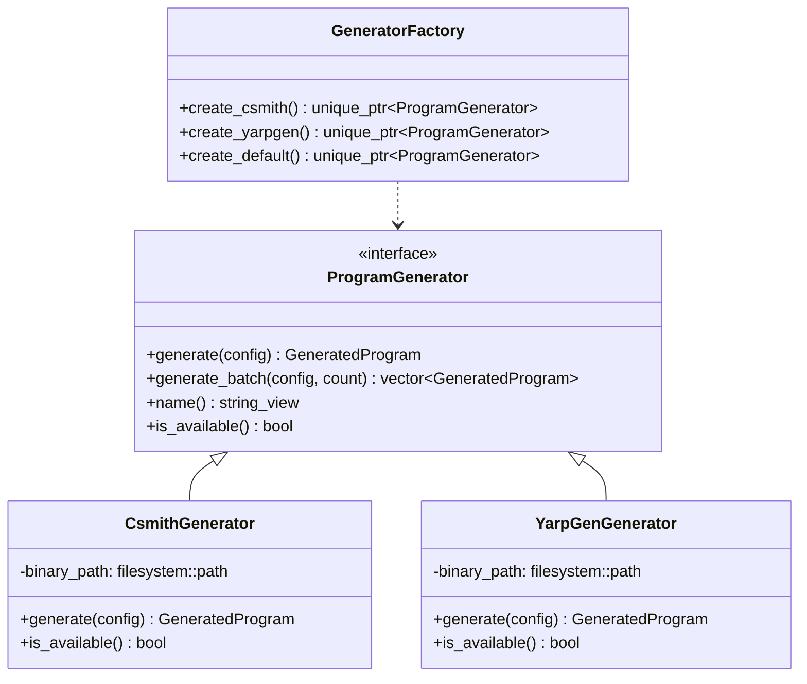
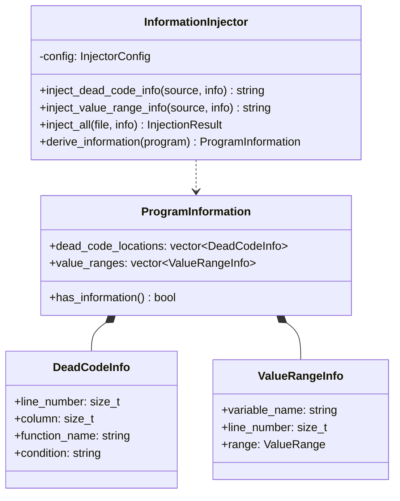
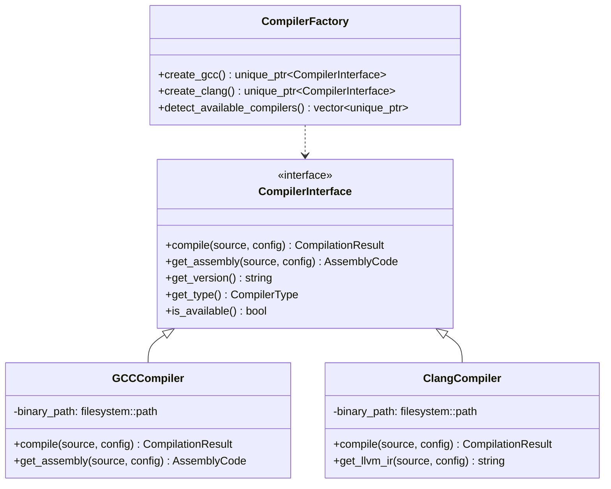
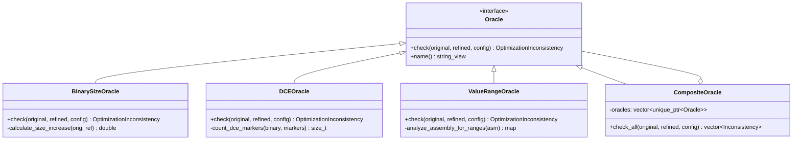
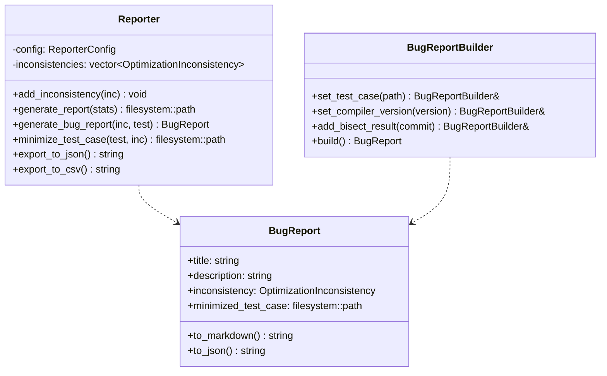
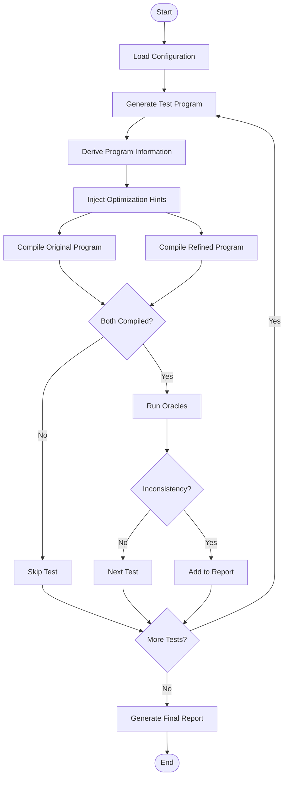
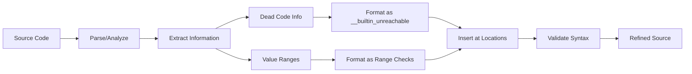

# Architecture Documentation

## System Overview

The Compiler Optimization Inconsistency Tester is designed as a modular, extensible framework for detecting optimization regressions in modern compilers. The architecture follows the Single Responsibility Principle with clear separation of concerns.

## Design Principles

### 1. Modularity
Each component has a well-defined interface and can be replaced or extended independently.

### 2. Type Safety
Leverages C++23 features like concepts, ranges, and strong typing to prevent errors at compile time.

### 3. Performance
Optimized for throughput with parallel compilation support and efficient data structures.

### 4. Extensibility
New compilers, oracles, and generators can be added without modifying existing code.

## Component Details

### Program Generator Module



**Responsibilities:**
- Generate random C/C++ programs for testing
- Support multiple program generation backends
- Provide deterministic generation with seeds

**Key Classes:**
- `ProgramGenerator`: Abstract interface for program generators
- `CsmithGenerator`: Csmith-based implementation
- `YarpGenGenerator`: YarpGen-based implementation
- `GeneratorFactory`: Factory for creating generators

### Information Injector Module



**Responsibilities:**
- Analyze programs to derive optimization information
- Inject optimization hints into source code
- Support multiple hint formats (__builtin_unreachable, [[assume]], etc.)

**Key Features:**
- Multiple injection strategies
- Preserves source formatting
- Adds explanatory comments
- Validates injected information

### Compiler Interface Module



**Responsibilities:**
- Abstract compiler-specific operations
- Provide unified interface for multiple compilers
- Handle compilation timeouts and errors
- Extract assembly and intermediate representations

**Supported Compilers:**
- GCC (13.3+)
- Clang/LLVM (18.1+)
- Extensible to MSVC, ICC, etc.

### Oracle Module



**Responsibilities:**
- Detect optimization inconsistencies
- Support multiple detection strategies
- Provide severity scoring
- Generate detailed descriptions

**Oracle Types:**

1. **BinarySizeOracle**: Detects when refined programs produce larger binaries
2. **DCEOracle**: Detects dead code elimination regressions
3. **ValueRangeOracle**: Detects value range analysis degradation
4. **AssemblyOracle**: Compares assembly instruction sequences
5. **CompositeOracle**: Runs multiple oracles in sequence

### Reporter Module



**Responsibilities:**
- Aggregate and organize detected inconsistencies
- Generate reports in multiple formats
- Integrate with C-Reduce for test minimization
- Automate git bisect for regression identification

**Report Formats:**
- **Markdown**: GitHub-friendly reports
- **JSON**: Machine-readable exports
- **HTML**: Interactive web reports
- **XML**: Structured data format
- **CSV**: Spreadsheet compatibility

## Data Flow

### Test Execution Flow



### Information Injection Flow



## Thread Safety

### Concurrent Operations

The framework supports parallel test execution:

```cpp
// Thread-safe components
- ProgramGenerator::generate_batch() // Parallel generation
- CompilerInterface::compile()       // Independent compilations
- Oracle::check()                    // Stateless operations

// Thread-unsafe components (require synchronization)
- Reporter::add_inconsistency()      // Requires mutex
```

### Synchronization Strategy

```cpp
class Reporter {
    mutable std::mutex mutex_;

    void add_inconsistency(const OptimizationInconsistency& inc) {
        std::lock_guard<std::mutex> lock(mutex_);
        inconsistencies_.push_back(inc);
    }
};
```

## Error Handling

### Exception Hierarchy

```
std::exception
├── std::runtime_error
│   ├── CompilationError
│   ├── GeneratorError
│   └── InjectionError
└── std::logic_error
    ├── ConfigurationError
    └── OracleError
```

### Error Recovery

1. **Compilation Failures**: Log and continue with next test
2. **Generator Failures**: Retry with different seed or skip
3. **Oracle Failures**: Fall back to other oracles
4. **I/O Errors**: Report and terminate gracefully

## Performance Considerations

### Optimization Strategies

1. **Parallel Compilation**: Multiple programs compiled simultaneously
2. **Caching**: Compiled binaries cached for repeated tests
3. **Early Termination**: Stop testing on first inconsistency (optional)
4. **Resource Limits**: Timeout controls for long-running compilations

### Memory Management

- RAII for all resource management
- Smart pointers for ownership semantics
- Move semantics for efficient data transfer
- Memory-mapped files for large outputs

## Extension Points

### Adding a New Compiler

```cpp
class MyCompiler : public CompilerInterface {
public:
    auto compile(const filesystem::path& source,
                 const CompilerConfig& config)
        -> CompilationResult override {
        // Implementation
    }

    // Implement other virtual methods...
};

// Register in factory
auto CompilerFactory::create_my_compiler()
    -> unique_ptr<CompilerInterface> {
    return make_unique<MyCompiler>();
}
```

### Adding a New Oracle

```cpp
class MyOracle : public Oracle {
public:
    auto check(const CompilationResult& original,
               const CompilationResult& refined,
               const OracleConfig& config)
        -> optional<OptimizationInconsistency> override {
        // Custom detection logic
    }
};
```

### Adding a New Generator

```cpp
class MyGenerator : public ProgramGenerator {
public:
    auto generate(const GeneratorConfig& config)
        -> optional<GeneratedProgram> override {
        // Custom generation logic
    }
};
```

## Testing Strategy

### Unit Tests

- Test each component in isolation
- Mock dependencies using interfaces
- Focus on edge cases and error conditions

### Integration Tests

- Test complete workflows
- Verify component interactions
- Use real compilers and generators

### Performance Tests

- Benchmark compilation throughput
- Measure memory usage
- Profile hotspots

## Future Enhancements

### Planned Features

1. **Distributed Testing**: Run tests across multiple machines
2. **Machine Learning**: Predict likely inconsistencies
3. **Interactive Dashboard**: Web-based result visualization
4. **Docker Integration**: Containerized testing environments
5. **Cloud Support**: AWS/GCP integration for massive parallelism

### Scalability Improvements

- Database backend for results
- Distributed task queue
- Incremental testing
- Result caching across runs

---

*This architecture is designed to be maintainable, testable, and extensible while maintaining high performance.*
