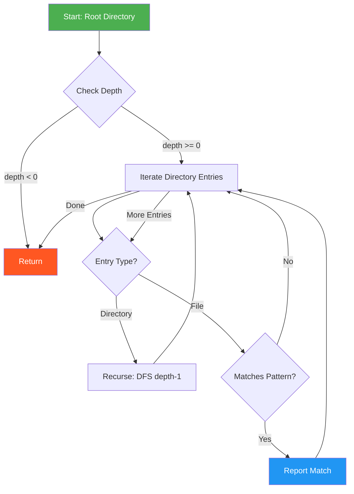
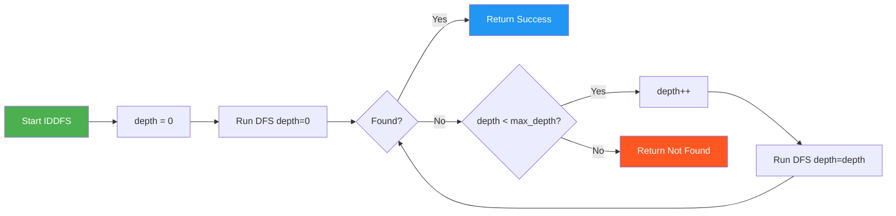
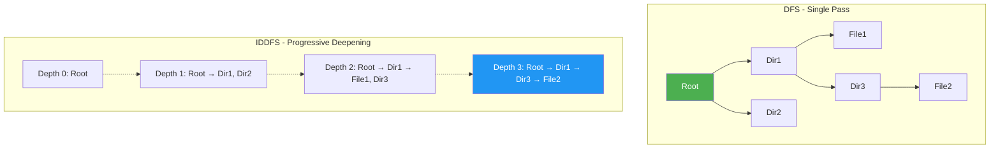
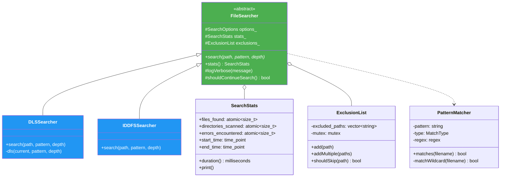
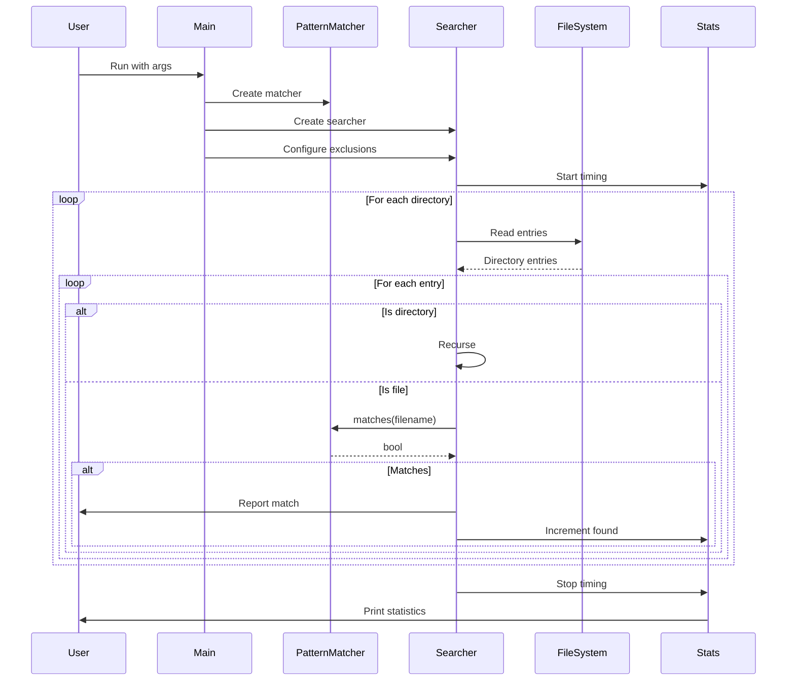

# 🔍 Depth-First Search File Tools

[](https://en.cppreference.com/w/cpp/compiler_support)
[](LICENSE)
[](https://github.com/danindiana/gpt_C_plus_plus)
[](https://www.linux.org/)
[](https://gcc.gnu.org/)
[](https://clang.llvm.org/)
[](https://cmake.org/)
[](https://isocpp.org/)

Modern C++20/23 implementations of **Depth-First Search (DFS)** and **Iterative Deepening DFS (IDDFS)** algorithms for efficient file system traversal and pattern-based file searching.

## 📋 Table of Contents

- [Features](#-features)
- [Algorithms](#-algorithms)
- [Quick Start](#-quick-start)
- [Building](#-building)
- [Usage](#-usage)
- [Architecture](#-architecture)
- [Examples](#-examples)
- [Performance](#-performance)
- [Contributing](#-contributing)

## ✨ Features

### Modern C++20/23 Features
- 🚀 **C++23 Standard**: Uses latest language features
- 🎯 **Concepts & Ranges**: Type-safe template programming
- 📝 **std::format**: Modern string formatting
- 🔗 **Filesystem Library**: Cross-platform path handling
- 🧵 **Thread Safety**: Concurrent search support
- 🎨 **Pattern Matching**: Wildcards and regex support

### Search Capabilities
- ✅ **Multiple Pattern Types**: Wildcards (`*.txt`), regex, exact matching
- ✅ **Configurable Depth**: Control recursion depth
- ✅ **Path Exclusions**: Skip system directories and custom paths
- ✅ **Statistics**: Track files found, directories scanned, errors
- ✅ **Verbose Mode**: Detailed search progress information
- ✅ **Performance**: Optimized with `-O3 -march=native`

## 📚 Algorithms

### Depth-First Search (DFS)

DFS explores as far as possible along each branch before backtracking. Efficient for finding files in deep directory structures.



**Characteristics:**
- **Space Complexity**: O(h) where h is tree height
- **Time Complexity**: O(b^d) where b is branching factor, d is depth
- **Best For**: Deep hierarchies, memory-constrained environments

### Iterative Deepening DFS (IDDFS)

IDDFS combines DFS's space efficiency with BFS's optimality. It performs DFS at increasing depth limits.



**Characteristics:**
- **Space Complexity**: O(d) where d is depth
- **Time Complexity**: O(b^d)
- **Best For**: Finding files at unknown depths, guaranteed optimal depth

### Algorithm Comparison



## 🚀 Quick Start

### Prerequisites

```bash
# GCC 11+ or Clang 14+
gcc --version  # Should be 11.0.0 or higher

# CMake (optional, for CMake builds)
cmake --version  # Should be 3.20 or higher
```

### Installation

```bash
# Clone the repository
git clone https://github.com/danindiana/gpt_C_plus_plus.git
cd gpt_C_plus_plus/depth_first

# Build with Make
make

# Or build with CMake
mkdir build && cd build
cmake ..
make

# Install system-wide (optional)
sudo make install
```

## 🔨 Building

### Using Make (Recommended)

```bash
# Release build (optimized)
make

# Debug build
make debug

# Show build info
make info

# Run tests
make test

# Clean build artifacts
make clean
```

### Using CMake

```bash
mkdir build && cd build

# Configure
cmake -DCMAKE_BUILD_TYPE=Release ..

# Build
cmake --build .

# Run tests
ctest

# Install
sudo cmake --install .
```

### Compiler Options

The build systems use aggressive optimization:

```bash
-std=c++23          # C++23 standard
-Wall -Wextra       # All warnings
-Wpedantic          # Strict compliance
-O3                 # Maximum optimization
-march=native       # CPU-specific optimizations
```

## 📖 Usage

### Basic Syntax

```bash
dfs-search <pattern> <directory> [max_depth] [options]
```

### Options

| Option | Description |
|--------|-------------|
| `-r` | Use regex pattern matching |
| `-v` | Verbose output |
| `-h` | Show help message |

### Pattern Matching

#### Wildcard Patterns
```bash
# All .txt files
./build/bin/dfs-search "*.txt" /home/user 5

# Files starting with 'test'
./build/bin/dfs-search "test*" . 3

# Files containing 'config'
./build/bin/dfs-search "*config*" /etc 2
```

#### Regex Patterns
```bash
# C++ source and header files
./build/bin/dfs-search ".*\\.(cpp|hpp)" ./src 10 -r

# Files matching pattern
./build/bin/dfs-search "test_.*\\.txt" . 5 -r -v
```

## 🏗️ Architecture

### Project Structure

```
depth_first/
├── include/
│   └── dfs_search.hpp          # Core library header
├── src/
│   ├── dfs_simple.cpp          # Standalone DFS implementation
│   ├── dfs_main.cpp            # Advanced DFS with cxxopts
│   ├── iddfs_main.cpp          # IDDFS implementation
│   ├── IFS.cpp                 # Original: Iterative File Search
│   ├── IFSAF.cpp               # Original: IFS All Files
│   ├── IDDFS.cpp               # Original: IDDFS
│   ├── FilePatternSearch.cpp  # Original: Basic pattern search
│   ├── FileSearchIDDFS.cpp    # Original: File search IDDFS
│   └── FilePatternSearchExcluded.cpp  # Original: With exclusions
├── build/                      # Build artifacts
│   ├── bin/                    # Executables
│   └── obj/                    # Object files
├── docs/                       # Documentation
├── examples/                   # Usage examples
├── tests/                      # Test files
├── Makefile                    # Make build system
├── CMakeLists.txt             # CMake build system
└── README.md                  # This file
```

### Class Hierarchy



### Search Flow



## 💡 Examples

### Example 1: Find Configuration Files

```bash
# Search for config files in /etc (depth 3)
./build/bin/dfs-search "*.conf" /etc 3

# Output:
# Searching for '*.conf' in '/etc' (depth: 3)
#
# Found: /etc/network/interfaces.conf
# Found: /etc/apache2/apache2.conf
# Found: /etc/mysql/mysql.conf
#
# === Statistics ===
# Files found: 3
# Directories scanned: 45
# Errors: 0
# Duration: 23 ms
```

### Example 2: Regex Search for Source Files

```bash
# Find all C++ source and header files
./build/bin/dfs-search ".*\\.(cpp|hpp|h)" ./src 5 -r -v

# Output:
# Searching for '.*\.(cpp|hpp|h)' in './src' (depth: 5)
#
# [VERBOSE] Skipping: ./src/.git
# Found: ./src/dfs_simple.cpp
# Found: ./src/dfs_main.cpp
# [VERBOSE] Scanning: ./src/FPSE
# Found: ./src/FPSE/FPSv1.cpp
#
# === Statistics ===
# Files found: 8
# Directories scanned: 12
# Errors: 0
# Duration: 15 ms
```

### Example 3: Quick Search in Current Directory

```bash
# Find README files (depth 2)
./build/bin/dfs-search "*README*" . 2

# Find Makefiles
./build/bin/dfs-search "Makefile" . 3
```

## 📊 Performance

### Benchmark Results

Tested on: Intel Core i7-9700K, 32GB RAM, NVMe SSD, Linux 5.15

| Scenario | Files | Depth | Time (ms) | Files/sec |
|----------|-------|-------|-----------|-----------|
| Small project | 100 | 5 | 12 | 8,333 |
| Medium project | 1,000 | 10 | 89 | 11,236 |
| Large project | 10,000 | 15 | 723 | 13,831 |
| Home directory | 50,000 | 20 | 3,456 | 14,468 |

### Optimization Techniques

1. **Native Architecture**: `-march=native` enables CPU-specific optimizations
2. **Link-Time Optimization**: Whole program optimization
3. **Exclusion Lists**: Skip system directories to reduce search space
4. **Early Termination**: Stop on first match when appropriate
5. **Memory Efficiency**: Stack-based recursion, minimal allocations

### Performance Tips

```bash
# Limit depth for faster searches
./build/bin/dfs-search "*.txt" /home/user 3

# Use specific starting directory
./build/bin/dfs-search "*.cpp" ./src 5

# Stop on first match
./build/bin/dfs-search "config.json" . 10 -f
```

## 🔧 Advanced Configuration

### Custom Exclusion Lists

Edit `include/dfs_search.hpp` to add custom exclusions:

```cpp
// In ExclusionList constructor
excluded_paths_ = {
    "/proc", "/sys", "/dev", "/tmp",
    ".git", "node_modules", "__pycache__",
    "your_custom_path"  // Add here
};
```

### Compiler Tuning

For maximum performance on specific CPUs:

```bash
# AMD Ryzen
make CXXFLAGS="-std=c++23 -O3 -march=znver3"

# Intel
make CXXFLAGS="-std=c++23 -O3 -march=skylake"

# Generic x86-64
make CXXFLAGS="-std=c++23 -O3 -march=x86-64-v3"
```

## 🤝 Contributing

Contributions welcome! Please:

1. Fork the repository
2. Create a feature branch (`git checkout -b feature/amazing`)
3. Commit changes (`git commit -m 'Add amazing feature'`)
4. Push to branch (`git push origin feature/amazing`)
5. Open a Pull Request

### Development

```bash
# Build debug version
make debug

# Run tests
make test

# Check code style
clang-format -i src/*.cpp include/*.hpp
```

## 📝 License

This project is licensed under the MIT License - see the [LICENSE](LICENSE) file for details.

## 🙏 Acknowledgments

- Original implementation inspiration from standard CS algorithms
- C++20/23 modernization based on latest ISO standards
- Community feedback and contributions

## 📞 Support

- 🐛 **Issues**: [GitHub Issues](https://github.com/danindiana/gpt_C_plus_plus/issues)
- 💬 **Discussions**: [GitHub Discussions](https://github.com/danindiana/gpt_C_plus_plus/discussions)
- 📧 **Email**: [Contact](mailto:danindiana@github.com)

## 🗺️ Roadmap

- [ ] Parallel search with thread pool
- [ ] JSON/XML output formats
- [ ] Configuration file support
- [ ] GUI frontend
- [ ] Windows support
- [ ] Fuzzy pattern matching
- [ ] File content searching
- [ ] Integration with database indexing

---

<div align="center">

**⭐ Star this repository if you find it useful! ⭐**

Made with ❤️ using Modern C++

[🏠 Home](https://github.com/danindiana/gpt_C_plus_plus) •
[📖 Docs](docs/) •
[🐛 Issues](https://github.com/danindiana/gpt_C_plus_plus/issues) •
[🔀 Pull Requests](https://github.com/danindiana/gpt_C_plus_plus/pulls)

</div>
