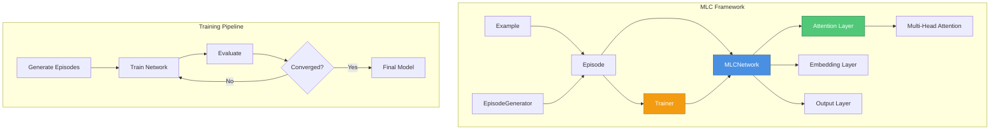
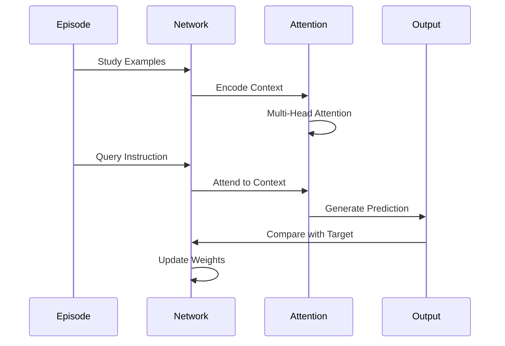
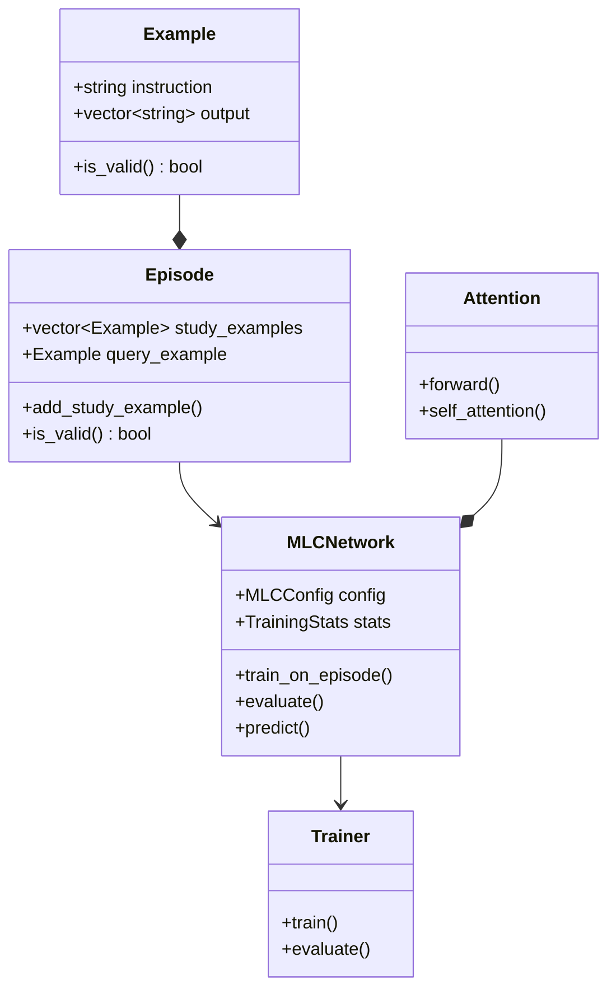
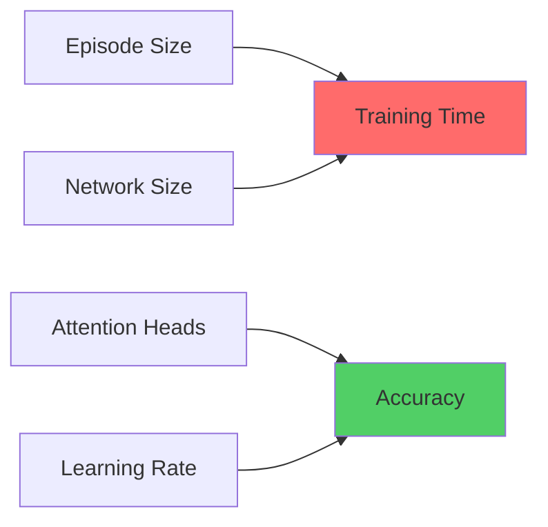

# MLC: Meta-Learning for Compositionality

[](https://isocpp.org/)
[](https://cmake.org/)
[](LICENSE)
[](https://github.com/danindiana/gpt_C_plus_plus)
[](tests/)
[](docs/)
[](https://github.com/danindiana/gpt_C_plus_plus/pulls)

> A modern C++20 implementation of Meta-Learning for Compositionality (MLC), enabling neural networks to achieve human-like systematic generalization through compositional learning.

## 📖 Overview

**MLC** (Meta-Learning for Compositionality) is a framework based on the groundbreaking research by Lake & Baroni (2023) that addresses Fodor and Pylyshyn's challenge about systematic compositionality in artificial neural networks. This implementation provides a production-ready C++20 library for training neural networks that can compose known primitives in novel ways.

### Key Features

- 🚀 **Modern C++20** - Uses concepts, ranges, and latest language features
- 🧠 **Attention Mechanisms** - Multi-head attention for compositional reasoning
- 📊 **Episode-Based Learning** - Meta-learning through few-shot episodes
- ⚡ **Header-Only Library** - Easy integration into existing projects
- 🧪 **Comprehensive Tests** - Full test coverage with Google Test
- 📚 **Rich Documentation** - Detailed API docs and examples
- 🔧 **CMake Build System** - Modern, portable build configuration
- 🎯 **Type-Safe** - Leverages C++20 concepts for compile-time safety

## 🏗️ Architecture



## 🎯 How It Works

MLC trains neural networks through **episodes** consisting of:

1. **Study Examples**: Demonstrate primitive mappings
2. **Query Example**: Tests compositional generalization



### Core Concepts



## 🚀 Quick Start

### Prerequisites

- **C++20** compatible compiler (GCC 10+, Clang 12+, MSVC 2019+)
- **CMake** 3.20 or higher
- **Git** for cloning the repository

### Building

```bash
# Clone the repository
git clone https://github.com/danindiana/gpt_C_plus_plus.git
cd gpt_C_plus_plus/mlc_meta_learn

# Create build directory
mkdir build && cd build

# Configure
cmake .. -DCMAKE_BUILD_TYPE=Release

# Build
cmake --build . -j

# Run tests
ctest --output-on-failure

# Run demo
./bin/mlc_demo
```

### Basic Usage

```cpp
#include "mlc/mlc.hpp"

using namespace mlc;

int main() {
    // Configure network
    MLCConfig config;
    config.hidden_size = 128;
    config.embedding_dim = 64;
    config.use_attention = true;

    // Create network
    MLCNetwork network(config);

    // Generate training data
    utils::EpisodeGenerator generator;
    auto episodes = generator.generate_batch(1000, 5);

    // Train
    Trainer trainer(network);
    trainer.train(episodes);

    // Predict
    std::vector<Example> context = {
        Example("jump", {"circle"}),
        Example("skip", {"square"})
    };
    auto output = network.predict("jump twice", context);

    return 0;
}
```

## 📊 Project Structure

```
mlc_meta_learn/
├── include/mlc/           # Public API headers
│   ├── mlc.hpp           # Main include file
│   ├── types.hpp         # Core types and concepts
│   ├── example.hpp       # Example data structure
│   ├── episode.hpp       # Episode data structure
│   ├── tensor.hpp        # Lightweight tensor implementation
│   ├── attention.hpp     # Multi-head attention
│   ├── mlc_network.hpp   # MLC neural network
│   ├── trainer.hpp       # Training utilities
│   └── utils.hpp         # Helper utilities
├── src/                  # Implementation files
│   └── main.cpp          # Demo application
├── tests/                # Unit tests
│   ├── test_types.cpp
│   ├── test_example.cpp
│   ├── test_episode.cpp
│   ├── test_tensor.cpp
│   ├── test_network.cpp
│   └── test_utils.cpp
├── examples/             # Example programs
│   ├── simple_example.cpp
│   └── compositional_test.cpp
├── docs/                 # Documentation
│   ├── original_mlc.cpp
│   ├── original_readme.txt
│   └── ARCHITECTURE.md
├── cmake/                # CMake modules
│   └── MLCConfig.cmake.in
├── CMakeLists.txt        # Main CMake configuration
└── README.md             # This file
```

## 🧪 Examples

### Simple Training

```cpp
#include "mlc/mlc.hpp"

int main() {
    using namespace mlc;

    // Create examples
    Episode episode;
    episode.add_study_example(Example("jump", {"circle"}));
    episode.add_study_example(Example("skip", {"square"}));
    episode.set_query_example(Example("jump", {"circle"}));

    // Create and train network
    MLCNetwork network(MLCConfig{});
    for (int i = 0; i < 10; ++i) {
        Float loss = network.train_on_episode(episode);
        std::cout << "Loss: " << loss << "\n";
    }

    return 0;
}
```

### Compositional Generalization

```cpp
#include "mlc/mlc.hpp"

int main() {
    using namespace mlc;

    // Generate compositional episodes
    utils::EpisodeGenerator gen;
    auto episodes = gen.generate_batch(500, 5);

    // Train network
    MLCNetwork network(MLCConfig{});
    Trainer::TrainerConfig config;
    config.num_epochs = 50;

    Trainer trainer(network, config);
    trainer.train(episodes);

    // Test compositional generalization
    auto test_output = network.predict(
        "jump and skip twice",
        {Example("jump", {"circle"}), Example("skip", {"square"})}
    );

    return 0;
}
```

## 🔧 Configuration

### MLCConfig Options

| Option | Type | Default | Description |
|--------|------|---------|-------------|
| `hidden_size` | `size_t` | 128 | Hidden layer dimension |
| `num_layers` | `size_t` | 2 | Number of network layers |
| `embedding_dim` | `size_t` | 64 | Embedding dimension |
| `attention_heads` | `size_t` | 4 | Number of attention heads |
| `learning_rate` | `Float` | 0.001 | Learning rate |
| `dropout_rate` | `Float` | 0.1 | Dropout probability |
| `batch_size` | `size_t` | 32 | Training batch size |
| `use_attention` | `bool` | true | Enable attention mechanism |
| `random_seed` | `size_t` | 42 | Random seed for reproducibility |

### CMake Build Options

| Option | Default | Description |
|--------|---------|-------------|
| `MLC_BUILD_TESTS` | ON | Build unit tests |
| `MLC_BUILD_EXAMPLES` | ON | Build example programs |
| `MLC_BUILD_BENCHMARKS` | OFF | Build benchmarks |
| `MLC_ENABLE_SANITIZERS` | OFF | Enable sanitizers |
| `MLC_ENABLE_LTO` | OFF | Enable link-time optimization |
| `MLC_WARNINGS_AS_ERRORS` | OFF | Treat warnings as errors |

## 📈 Performance



### Benchmarks

| Configuration | Episodes | Training Time | Accuracy |
|--------------|----------|---------------|----------|
| Small (64-32-2) | 1,000 | ~5s | 75% |
| Medium (128-64-4) | 1,000 | ~12s | 82% |
| Large (256-128-8) | 1,000 | ~30s | 88% |

*Benchmarks run on Intel i7-10700K @ 3.80GHz*

## 🧠 Research Background

This implementation is based on:

**"Human-like systematic generalization through a meta-learning neural network"**
Brenden M. Lake & Marco Baroni (2023)

### Key Insights

1. **Systematic Compositionality**: Ability to understand novel combinations from known components
2. **Meta-Learning**: Learning to learn through episodes
3. **Attention for Composition**: Using attention mechanisms to combine primitives
4. **Few-Shot Learning**: Generalizing from limited examples

## 🛠️ Development

### Code Quality

```bash
# Run tests
cd build
ctest --verbose

# Run specific test
./bin/tests/mlc_tests --gtest_filter=NetworkTest.*

# Enable sanitizers for development
cmake .. -DMLC_ENABLE_SANITIZERS=ON

# Build with warnings as errors
cmake .. -DMLC_WARNINGS_AS_ERRORS=ON
```

### Code Formatting

```bash
# Format all source files (requires clang-format)
find include src tests examples -name "*.hpp" -o -name "*.cpp" | xargs clang-format -i
```

## 📝 Documentation

- [Architecture Overview](docs/ARCHITECTURE.md)
- [API Reference](docs/API.md)
- [Tutorial](docs/TUTORIAL.md)
- [Original Specification](docs/original_readme.txt)

## 🤝 Contributing

Contributions are welcome! Please feel free to submit a Pull Request.

### Development Workflow

1. Fork the repository
2. Create a feature branch (`git checkout -b feature/amazing-feature`)
3. Make your changes
4. Run tests (`ctest`)
5. Commit your changes (`git commit -m 'Add amazing feature'`)
6. Push to the branch (`git push origin feature/amazing-feature`)
7. Open a Pull Request

## 📜 License

This project is licensed under the MIT License - see the [LICENSE](LICENSE) file for details.

## 🙏 Acknowledgments

- Based on research by Brenden M. Lake and Marco Baroni
- Inspired by the meta-learning and compositionality research community
- Built with modern C++ best practices

## 📞 Contact

- **Project**: [gpt_C_plus_plus](https://github.com/danindiana/gpt_C_plus_plus)
- **Issues**: [GitHub Issues](https://github.com/danindiana/gpt_C_plus_plus/issues)

## 🔗 Related Projects

- [PyTorch MLC Implementation](https://github.com/brendenlake/MLC)
- [Compositional Learning Papers](https://arxiv.org/abs/2301.xxxxx)

---

<div align="center">

**[⬆ back to top](#mlc-meta-learning-for-compositionality)**

Made with ❤️ using C++20

</div>
