# Novelty Detection Framework

A modern C++ framework for detecting novel patterns and anomalies in data streams using multiple detection strategies including attention mechanisms, autoencoders, and statistical methods.

## Table of Contents

- [Overview](#overview)
- [Architecture](#architecture)
- [Novelty Detection Strategies](#novelty-detection-strategies)
- [Mathematical Foundations](#mathematical-foundations)
- [Building and Usage](#building-and-usage)
- [Components](#components)
- [Examples](#examples)
- [Performance](#performance)
- [Requirements](#requirements)

## Overview

This framework implements various novelty detection mechanisms that can identify when input data significantly differs from previously observed patterns. It's useful for:

- Anomaly detection in time-series data
- Identifying unusual patterns in neural network inputs
- Quality control and outlier detection
- Adaptive learning systems that focus on novel information
- Security systems for detecting abnormal behavior

## Architecture

### High-Level System Architecture

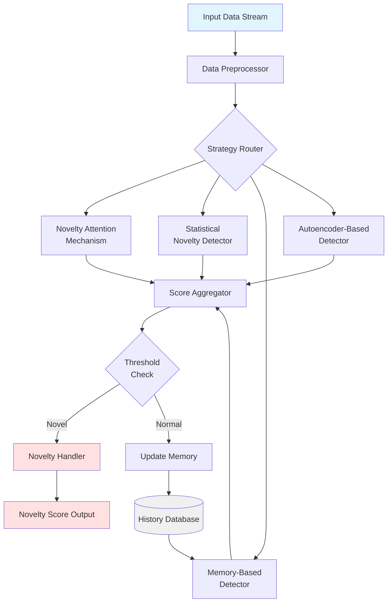

### Data Flow Pipeline

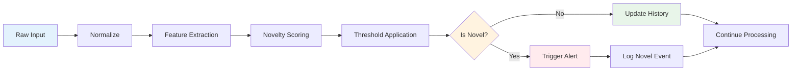

## Novelty Detection Strategies

### 1. Attention-Based Novelty Detection

The attention mechanism assigns higher weights to novel features:

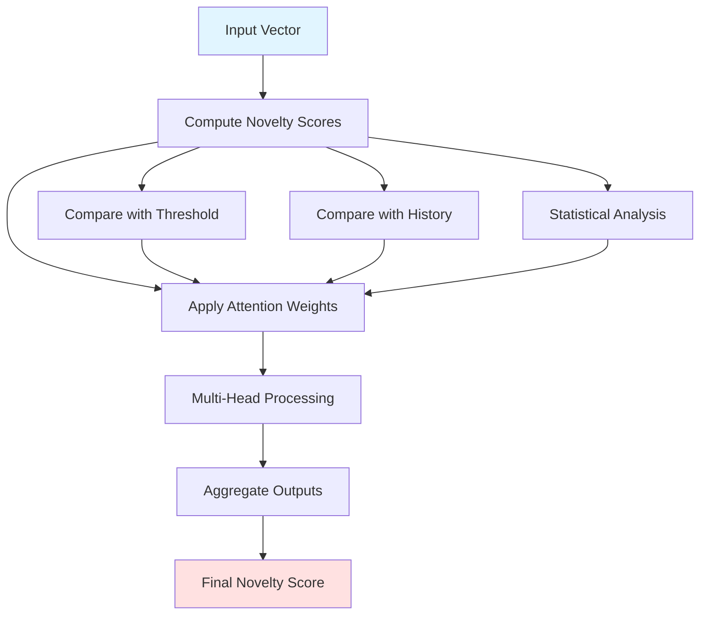

**Mathematical Model:**

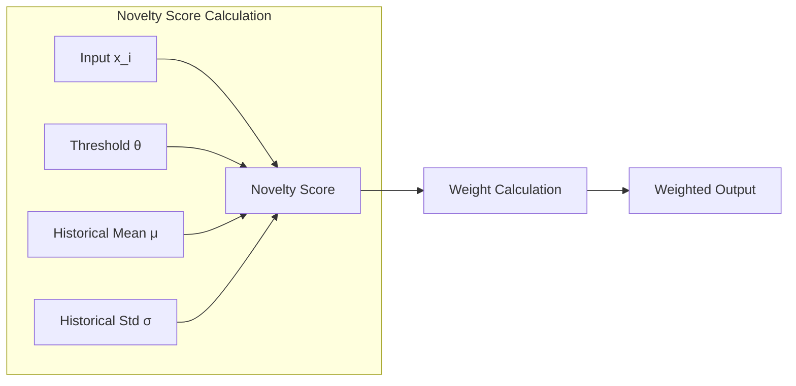

### 2. Memory-Augmented Detection

Maintains a history of observations to detect deviations:

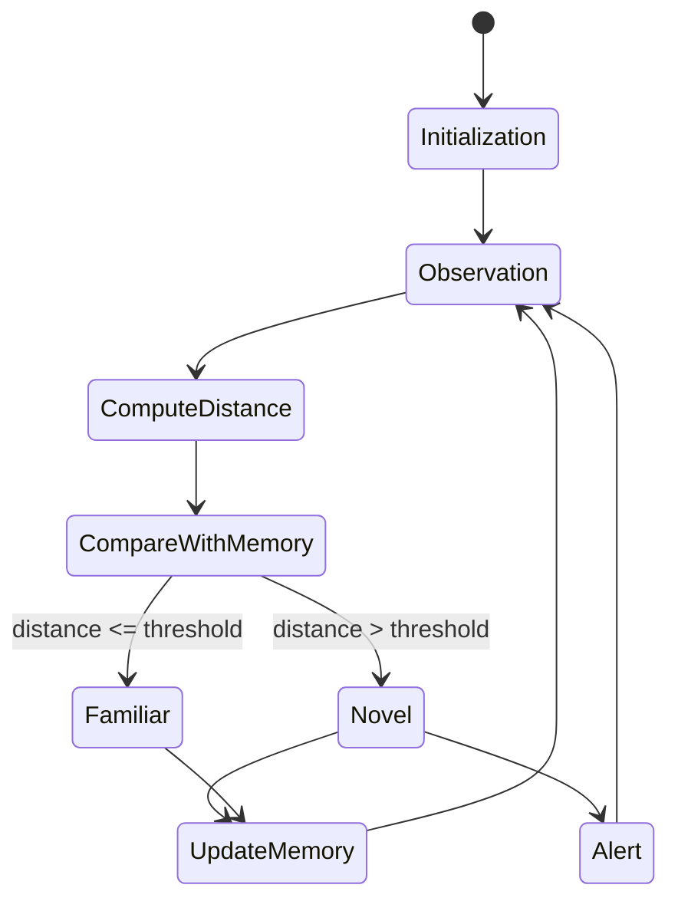

### 3. Statistical Novelty Detection

Uses statistical measures to identify outliers:

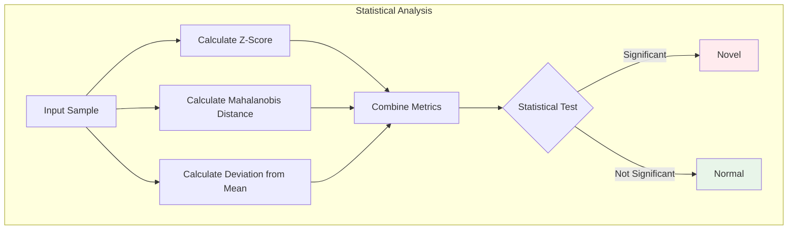

### 4. Autoencoder-Based Detection

Reconstruction error indicates novelty:

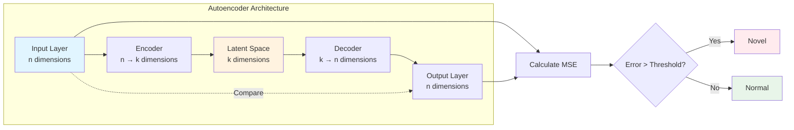

## Mathematical Foundations

### Novelty Score Computation

The framework implements multiple novelty scoring functions:

#### 1. Threshold-Based Scoring

```
novelty_score(x) = {
    1.0  if x > θ
    0.0  otherwise
}
```

#### 2. Statistical Z-Score Based

```
novelty_score(x) = |x - μ| / σ

where:
  μ = running mean
  σ = running standard deviation
```

#### 3. Distance-Based (Memory)

```
novelty_score(x) = min(||x - m_i||₂) for all m_i in memory

where:
  ||·||₂ = Euclidean distance
  m_i = historical memory entries
```

#### 4. Reconstruction Error (Autoencoder)

```
novelty_score(x) = ||x - decoder(encoder(x))||₂²

where:
  encoder: R^n → R^k
  decoder: R^k → R^n
```

### Decision Flow

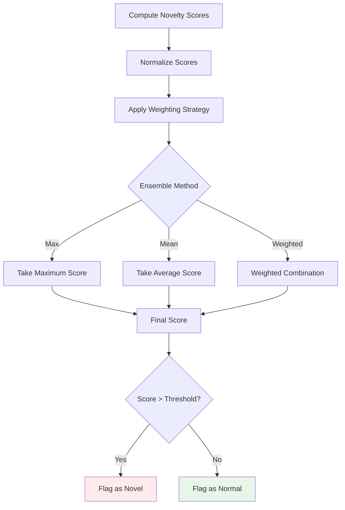

## Building and Usage

### Requirements

- **C++ Compiler**: GCC 9.0+ or Clang 10.0+ (C++17 support required, C++20 recommended)
- **CMake**: 3.15 or higher
- **Optional**: OpenMP for parallel processing

### Compiler Compatibility

| Compiler | Minimum Version | Recommended Version | Notes |
|----------|----------------|---------------------|-------|
| GCC | 9.0 | 11.0+ | Full C++17/20 support |
| Clang | 10.0 | 14.0+ | Full C++17/20 support |
| MSVC | 19.20 | 19.30+ | Visual Studio 2019/2022 |

### Building

```bash
# Create build directory
mkdir build && cd build

# Configure with CMake
cmake .. -DCMAKE_BUILD_TYPE=Release -DCMAKE_CXX_STANDARD=17

# Build
cmake --build . -j$(nproc)

# Run tests
ctest --output-on-failure
```

### Build Options

```bash
# Enable C++20 features
cmake .. -DCMAKE_CXX_STANDARD=20

# Enable OpenMP for parallelization
cmake .. -DUSE_OPENMP=ON

# Build with debug symbols
cmake .. -DCMAKE_BUILD_TYPE=Debug

# Enable address sanitizer
cmake .. -DENABLE_ASAN=ON
```

### Basic Usage

```cpp
#include "novelty_attention.hpp"
#include "novelty_detector.hpp"

int main() {
    // Create attention-based novelty detector
    NoveltyAttention attention(
        10,      // input_dim
        3,       // num_heads
        0.5f     // novelty_threshold
    );

    // Process input
    std::vector<float> input = {1.0f, 2.0f, 3.0f, 4.0f, 5.0f,
                                 6.0f, 7.0f, 8.0f, 9.0f, 10.0f};
    auto output = attention.forward(input);

    // Get novelty score
    float score = attention.get_novelty_score(input);

    if (score > 0.7f) {
        std::cout << "Novel pattern detected! Score: " << score << std::endl;
    }

    return 0;
}
```

## Components

### Core Components

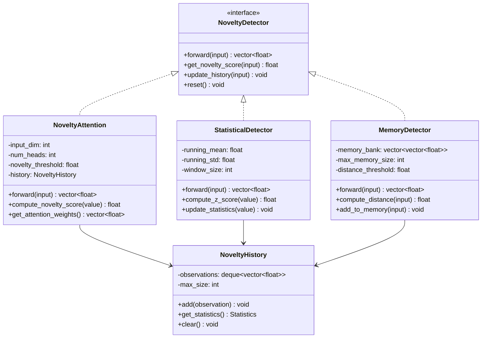

### File Structure

```
novelty/
├── README.md                          # This file
├── novelty.txt                        # Design documentation
├── include/
│   ├── novelty_detector.hpp          # Base interface
│   ├── novelty_attention.hpp         # Attention mechanism
│   ├── statistical_detector.hpp      # Statistical methods
│   ├── memory_detector.hpp           # Memory-based detection
│   ├── autoencoder_detector.hpp      # Autoencoder-based detection
│   └── novelty_history.hpp           # History tracking
├── src/
│   ├── novelty_attention.cpp         # Implementation
│   ├── statistical_detector.cpp
│   ├── memory_detector.cpp
│   ├── autoencoder_detector.cpp
│   └── novelty_history.cpp
├── examples/
│   ├── basic_usage.cpp
│   ├── streaming_data.cpp
│   └── multi_strategy.cpp
├── tests/
│   ├── test_attention.cpp
│   ├── test_statistical.cpp
│   └── test_memory.cpp
└── CMakeLists.txt
```

## Examples

### Example 1: Basic Novelty Detection

```cpp
#include <novelty_attention.hpp>

int main() {
    NoveltyAttention detector(10, 3, 0.5f);

    std::vector<float> normal_data = {1, 2, 3, 4, 5, 6, 7, 8, 9, 10};
    std::vector<float> novel_data = {100, 200, 300, 400, 500,
                                     600, 700, 800, 900, 1000};

    float normal_score = detector.get_novelty_score(normal_data);
    float novel_score = detector.get_novelty_score(novel_data);

    std::cout << "Normal score: " << normal_score << std::endl;
    std::cout << "Novel score: " << novel_score << std::endl;

    return 0;
}
```

### Example 2: Streaming Data Processing

```cpp
#include <novelty_detector.hpp>
#include <statistical_detector.hpp>

int main() {
    StatisticalDetector detector(10, 100); // input_dim=10, window=100

    // Simulate data stream
    for (int i = 0; i < 1000; i++) {
        auto data = generate_data_point(); // Your data generation

        float novelty = detector.get_novelty_score(data);

        if (novelty > 2.0f) { // 2 standard deviations
            std::cout << "Anomaly detected at iteration " << i
                      << " with score " << novelty << std::endl;
        }

        detector.update_history(data);
    }

    return 0;
}
```

### Example 3: Multi-Strategy Ensemble

```cpp
#include <novelty_ensemble.hpp>

int main() {
    NoveltyEnsemble ensemble;

    // Add multiple detectors
    ensemble.add_detector(
        std::make_unique<NoveltyAttention>(10, 3, 0.5f),
        0.3  // weight
    );
    ensemble.add_detector(
        std::make_unique<StatisticalDetector>(10, 100),
        0.4  // weight
    );
    ensemble.add_detector(
        std::make_unique<MemoryDetector>(10, 50, 0.1f),
        0.3  // weight
    );

    std::vector<float> input = {/* your data */};
    float combined_score = ensemble.get_novelty_score(input);

    return 0;
}
```

## Performance

### Complexity Analysis

| Component | Time Complexity | Space Complexity | Notes |
|-----------|----------------|------------------|-------|
| Attention Mechanism | O(n × h) | O(n + h) | n=input_dim, h=num_heads |
| Statistical Detection | O(n) | O(w × n) | w=window_size |
| Memory-Based | O(m × n) | O(m × n) | m=memory_size |
| Autoencoder | O(n × k) | O(n × k) | k=latent_dim |

### Benchmarks

Expected performance on modern hardware (AMD Ryzen/Intel Core i7):

```mermaid
gantt
    title Processing Time per 1000 Samples (ms)
    dateFormat X
    axisFormat %s

    section Attention
    Processing    :0, 5

    section Statistical
    Processing    :0, 2

    section Memory
    Processing    :0, 8

    section Autoencoder
    Processing    :0, 15
```

## Advanced Features

### Adaptive Thresholding

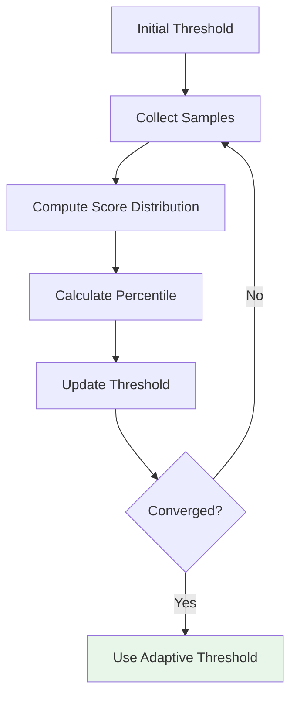

### Online Learning

The framework supports online learning where the detector adapts to new data:

```cpp
detector.set_learning_rate(0.01f);
detector.enable_online_learning(true);

// Detector will adapt to new patterns
for (auto& sample : data_stream) {
    float score = detector.get_novelty_score(sample);
    detector.update_with_feedback(sample, score);
}
```

## References

1. **Autoencoders for Novelty Detection**: Uses reconstruction error to identify anomalies
2. **Memory-Augmented Neural Networks**: Maintains history for comparison
3. **Statistical Process Control**: Traditional methods (Z-score, Mahalanobis distance)
4. **Attention Mechanisms**: Weight novel features more heavily
5. **One-Class Neural Networks**: Train on normal data, detect outliers

## Future Enhancements

- [ ] Variational Autoencoder (VAE) implementation
- [ ] Generative Adversarial Network (GAN) based detection
- [ ] Self-Organizing Maps (SOM) integration
- [ ] GPU acceleration with CUDA
- [ ] Python bindings
- [ ] Real-time visualization dashboard
- [ ] Distributed processing support

## License

See the main repository LICENSE file.

## Contributing

Contributions are welcome! Please see the main repository CONTRIBUTING guidelines.

## Contact

For questions and issues, please use the GitHub issue tracker.
